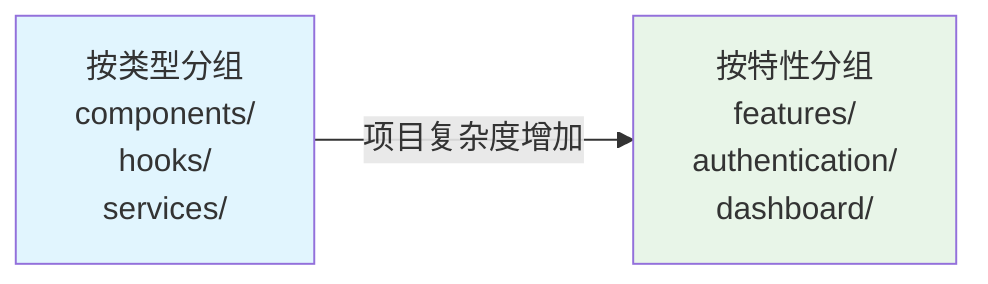

# 前端架构策略指南

## 演进路径

随着项目规模的扩展，简单的基于类型的结构会变得难以管理。项目架构需要从基于类型逐步演进到基于功能的组织方式。

1. 可组合性：React 鼓励通过可组合性在组件间重用代码，提升灵活性与复用性。
2. 本地优先：与组件强相关的代码应尽量保留在本地，避免目录臃肿。
3. 越扁平越好：目录结构尽量扁平，减少嵌套，降低心智负担。
4. 按需嵌套：随着项目规模增长，合理嵌套，按逻辑分组管理代码。



## 核心分组模式

### 按文件类型分组 (Type-Based Structure)

基于文件的技术性质进行组织，在 `src/` 目录下创建顶层的技术文件夹。

**目录结构**：

```
src/
├── components/     # 所有组件
├── hooks/         # 自定义 Hooks
├── services/      # API 服务
├── pages/         # 页面组件
├── utils/         # 工具函数
└── styles/        # 样式文件
```

**特点**：结构清晰，适合小型项目，但随着项目增长会变得臃肿。

### 按功能/模块分组 (Feature-Based Structure)

基于应用的特性或业务领域来组织文件，每个功能文件夹内部包含其自身的组件、Hooks、服务等。

**目录结构**：

```
src/
├── features/
│   ├── authentication/
│   │   ├── components/
│   │   ├── hooks/
│   │   ├── services/
│   │   └── pages/
│   ├── dashboard/
│   └── user-profile/
├── shared/          # 共享资源
│   ├── components/
│   ├── hooks/
│   └── utils/
└── app/            # 应用级配置
```

**特点**：业务逻辑集中，便于维护和团队协作，支持功能级别的重构。

## 关注点分离 (SoC)

在每个功能模块内部，将不同类型的代码分离开，实行按技术进行原子化分组。

**核心思想**：在一个模块内部，将 UI、状态管理、API 调用、工具函数等不同关注点分离。

**实践方式**：

```
src/features/user-management/
├── components/     # UI 组件
├── hooks/         # 状态逻辑
├── services/      # 数据获取
├── utils/         # 业务工具函数
└── types/         # 类型定义
```

## 原子设计 (Atomic Design)

一种用于创建设计系统的方法论，将用户界面分解为五个层级，构建系统化、可扩展的 UI 组件库。

**五个层级**：

**原子 (Atoms)**：最基本的 UI 元素，如 Button、Input、Label

**分子 (Molecules)**：由原子组合的简单组件群，如 SearchBox、FormField

**有机体 (Organisms)**：由分子和原子组成的复杂组件，如 Header、ProductList

**模板 (Templates)**：定义页面的内容结构和布局

**页面 (Pages)**：模板的具体实例，包含真实内容和数据

**组织结构**：

```
src/components/
├── atoms/
├── molecules/
├── organisms/
├── templates/
└── pages/
```

## 架构选择建议

**小型项目**：使用基于类型的简单结构，快速开发

**中型项目**：采用基于功能的模块化结构，便于团队协作

**大型项目**：结合原子设计的复杂架构，实现高度可复用的系统化设计

选择合适的架构策略需要根据项目规模、团队大小、业务复杂度等因素综合考虑。关键是保持架构的一致性和可维护性，通过合理的关注点分离和模块化设计提高代码质量。
