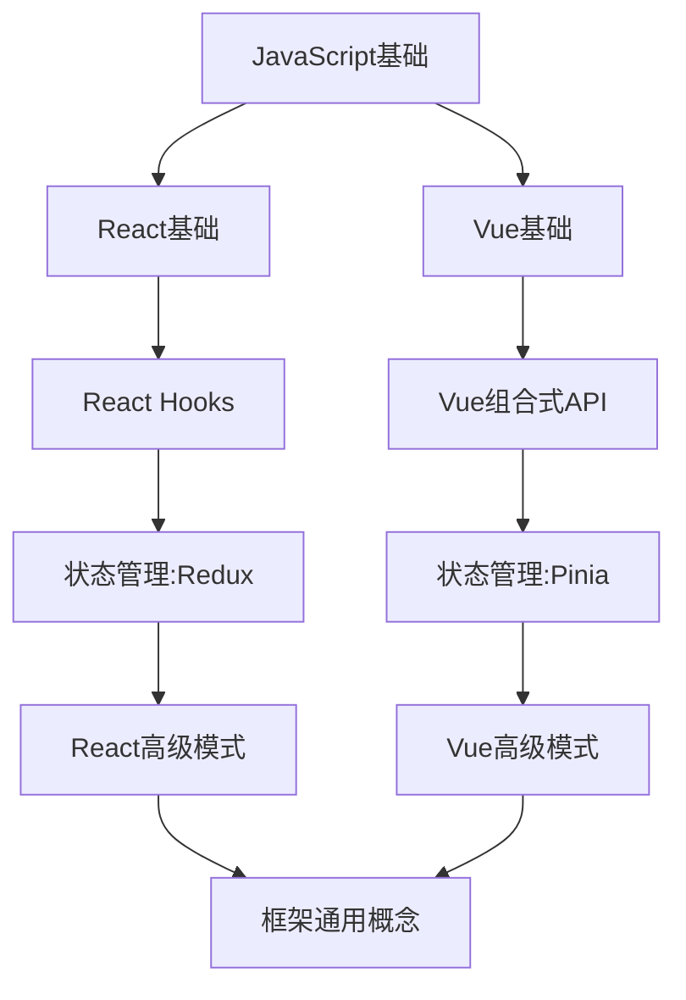

# 技术知识管理案例展示与范例库

## 概述

本文档展示了技术知识管理系统的实际应用案例和范例，帮助您理解如何将知识管理原则应用到实际工作中。通过具体示例，展示了不同类型知识的组织、关联和应用方式，以及如何解决常见的知识管理挑战。

## 案例1：前端框架学习与应用

### 背景

前端开发者小王需要同时掌握React和Vue两个框架，并在项目中灵活选用。他需要一个系统来组织学习资源、记录实践经验，并支持两个框架间的知识迁移。

### 解决方案

小王建立了以下知识结构：

1. **双框架MOC**
   - 创建React和Vue两个主要MOC
   - 添加"框架对比"MOC链接两者共同概念

2. **技术演进时间线**
   - 分别创建[[React技术演进时间线]]和[[Vue技术演进时间线]]
   - 在时间线中标记项目使用的版本点

3. **概念映射表**
   - 创建React和Vue概念对照表
   - 记录两个框架中类似功能的实现差异

4. **代码片段库**
   - 按功能分类存储常用代码（路由、状态管理等）
   - 每个功能提供两个框架的实现对比

5. **项目应用记录**
   - 记录每个项目的框架选择理由
   - 总结框架优缺点和适用场景

### 成果展示

**框架概念映射表示例：**

| 概念 | React | Vue | 注释 |
|------|-------|-----|------|
| 组件定义 | 函数组件/类组件 | 单文件组件(SFC) | React更灵活，Vue更集中 |
| 状态管理 | useState/useReducer | data/reactive | Vue的响应式更自动 |
| 副作用处理 | useEffect | watch/watchEffect | React需手动声明依赖 |
| 样式方案 | CSS-in-JS/模块化CSS | Scoped CSS/CSS Modules | Vue的作用域CSS更简单 |

**学习路径示例：**



### 应用效果

小王能够：
- 快速在两个框架间切换工作
- 利用一个框架的经验加速学习另一个
- 为项目选择最合适的框架并提供理由
- 复用通用知识减少重复学习

## 案例2：AI实验与模型优化

### 背景

AI研究员小李进行大语言模型微调实验，需要跟踪不同参数设置下的实验结果，积累经验，并找出最佳实践。

### 解决方案

小李构建了以下知识管理系统：

1. **实验记录模板**
   - 创建标准化实验记录模板
   - 包含参数配置、数据处理、结果和分析

2. **参数影响图**
   - 创建参数与性能关系图
   - 记录不同参数组合的效果

3. **错误案例集**
   - 记录常见错误和解决方案
   - 分析失败实验的原因

4. **模型演进记录**
   - 使用[[大语言模型技术演进时间线]]跟踪技术发展
   - 记录自己实验与行业进展的关系

5. **知识关联网络**
   - 链接相关论文、代码和实验记录
   - 构建知识依赖关系图

### 成果展示

**实验记录示例：**

```yaml
---
title: PEFT-LoRA微调实验#3
jd_id: 20.12.0045
created: 2025-04-12
updated: 2025-04-15
type: experiment
status: completed
tags: [主题/ai/llm, 主题/微调, 行动/实验]
model_base: LLaMA-7B
method: LoRA
---
```

**实验内容：**

```markdown
## 实验目标
提高模型在医疗领域的专业知识，同时保持通用能力

## 实验设置
- **基础模型**：LLaMA-7B
- **微调方法**：LoRA
- **数据集**：医疗问答集(5000条)
- **参数配置**：
  - r=8
  - alpha=16
  - 学习率=3e-4
  - Epochs=3
  - Batch size=64

## 实验结果
| 指标 | 基线模型 | 微调后 | 提升 |
|------|---------|-------|------|
| 医疗准确率 | 67.3% | 86.9% | +19.6% |
| 通用能力保持率 | 100% | 93.2% | -6.8% |

## 分析
医疗领域专业知识显著提高，同时通用能力保持良好。
r=8提供了足够的表达能力而不过拟合。

## 改进方向
1. 尝试更大r值看能否进一步提升专业能力
2. 探索如何减少通用能力的下降
```

### 应用效果

小李能够：
- 系统追踪实验进展和改进
- 从实验失败中学习并避免重复错误
- 快速找到最佳参数设置
- 将实验结果与研究理论联系起来

## 案例3：提示词工程最佳实践库

### 背景

产品经理小张负责AI产品的提示词设计，需要为不同场景创建最佳提示词，并持续优化提示策略。

### 解决方案

小张建立了以下系统：

1. **提示词模板库**
   - 按功能分类的提示词模板集合
   - 每个模板包含变量占位符和使用说明

2. **场景应用库**
   - 不同业务场景的提示词应用案例
   - 记录用户反馈和改进历史

3. **优化技巧集**
   - 提示词设计原则和技巧
   - 常见问题解决方案

4. **模型特性笔记**
   - 不同模型的特性和提示词适配方法
   - 模型版本更新的影响分析

5. **提示词测试框架**
   - 提示词评估标准和方法
   - A/B测试结果记录

### 成果展示

**提示词模板示例：**

```
# 客户支持回复生成器

## 模板
[系统提示]
你是一名专业的客户支持代表，为{{公司名}}工作。你需要回应客户的{{问题类型}}问题。使用专业、友好的语气，遵循以下原则：
1. 首先感谢客户的反馈
2. 直接回答客户的问题
3. 提供具体的解决步骤
4. 如需要，提供一个相关资源链接
5. 结束时表达继续帮助的意愿

回复必须简洁、专业且符合{{公司名}}的品牌风格。

[用户问题]
{{客户问题}}

## 变量说明
- {{公司名}}: 你的公司名称
- {{问题类型}}: 如技术支持、账单问题、产品咨询等
- {{客户问题}}: 客户实际提出的问题

## 使用示例
[输入]
公司名: TechSoft
问题类型: 技术支持
客户问题: "我无法登录我的账户，一直显示密码错误，但我确定密码是正确的。"

[输出]
"感谢您联系TechSoft技术支持。关于您的登录问题，我理解这可能会令人沮丧。请尝试以下步骤：

1. 确认大小写锁定键是否开启
2. 尝试重置密码：访问登录页面点击"忘记密码"
3. 清除浏览器缓存后再试

如果问题持续，请访问support.techsoft.com/login-help获取更详细的指导。

如有其他问题，随时告诉我，我很乐意继续帮助您。"

## 效果评估
该模板在客户满意度测试中评分为4.8/5，响应明确性评分为4.7/5。
```

**优化记录示例：**

```markdown
# 提示词优化：产品描述生成器

## 原始提示词
"根据以下产品信息生成描述：[产品信息]"

## 优化迭代

### 迭代1: 添加角色和目标
"你是一名专业的产品文案撰写人。根据以下产品信息，创建一段吸引人的产品描述：[产品信息]"

**效果**: 描述更有吸引力，但缺乏结构 (+15%)

### 迭代2: 添加结构指导
"你是一名专业的产品文案撰写人。根据以下产品信息，创建一段吸引人的产品描述。描述应包含:
1. 引人注目的开场白
2. 核心功能和优势(3-5点)
3. 针对目标用户的价值主张
4. 简短有力的结束语
产品信息: [产品信息]"

**效果**: 结构明显改善，内容更完整 (+35%)

### 迭代3: 添加风格和长度指导
"你是一名专业的产品文案撰写人。根据以下产品信息，创建一段吸引人的产品描述。使用积极主动的语气，保持简洁(100-150字)。描述应包含:
1. 引人注目的开场白
2. 核心功能和优势(3-5点)
3. 针对目标用户的价值主张
4. 带有行动召唤的结束语
产品信息: [产品信息]
目标受众: [目标受众]"

**效果**: 输出更简洁，针对性更强 (+50%)

## 最终版本
[最终优化的完整提示词]

## 主要发现
1. 明确角色和预期输出格式至关重要
2. 结构化指导显著提高输出质量
3. 增加目标受众信息能使输出更有针对性
```

### 应用效果

小张能够：
- 快速为新场景创建高质量提示词
- 系统化改进提示词效果
- 跟踪不同模型和场景的最佳实践
- 将成功经验应用到新项目中

## 范例库：知识管理文档模板

以下提供了几个关键知识管理文档的范例模板，您可以根据自己的需求进行调整和使用。

### 范例1：技术评估笔记

```markdown
---
title: [技术名称]评估
jd_id: [领域编号]
created: [创建日期]
updated: [更新日期]
type: evaluation
status: active
tags: [主题/技术, 行动/评估]
---

# [技术名称]评估

## 基本信息
- **技术名称**: [名称]
- **版本**: [评估的版本]
- **类型**: [框架/库/工具/语言]
- **主要用途**: [主要解决的问题]
- **评估时间**: [日期]

## 技术概述
[简要描述技术的核心功能和特点]

## 评估维度

### 成熟度
- **发布时间**: [首次发布日期]
- **当前版本**: [版本号及发布日期]
- **社区活跃度**: [高/中/低，提供证据]
- **企业支持**: [主要支持公司或组织]
- **成熟度评分**: [1-5分]

### 技术适用性
- **适用场景**: [列出最适合的场景]
- **不适用场景**: [列出不适合的场景]
- **技术门槛**: [简单/中等/复杂]
- **学习曲线**: [平缓/中等/陡峭]
- **适用性评分**: [1-5分]

### 性能与效率
- **性能特点**: [性能优势和限制]
- **资源消耗**: [内存/CPU/存储需求]
- **扩展性**: [如何处理扩展需求]
- **优化空间**: [可能的优化方向]
- **性能评分**: [1-5分]

### 生态系统
- **工具支持**: [开发工具和集成]
- **第三方库**: [重要的库和插件]
- **社区资源**: [教程、示例和论坛]
- **人才市场**: [相关技术人才供应情况]
- **生态评分**: [1-5分]

## 总体评估

### 优势
1. [优势1]
2. [优势2]
3. [优势3]

### 劣势
1. [劣势1]
2. [劣势2]
3. [劣势3]

### 风险分析
- **技术风险**: [技术层面的风险]
- **采用风险**: [采用过程中的风险]
- **长期风险**: [长期使用可能面临的风险]

### 对比分析
| 方面 | [本技术] | [替代技术1] | [替代技术2] |
|------|---------|------------|------------|
| 成熟度 | | | |
| 适用性 | | | |
| 性能 | | | |
| 生态系统 | | | |
| 总体评分 | | | |

## 使用建议

### 推荐使用场景
[详细描述推荐的应用场景]

### 实施策略
[如何引入和实施该技术]

### 学习资源
- [重要资源1]
- [重要资源2]
- [重要资源3]

## 结论与决策
[最终评估结论和采用决策]

## 更新记录
- [日期] - 初始评估
- [日期] - 基于新版本更新评估
```

### 范例2：代码模式笔记

```markdown
---
title: [模式名称]
jd_id: [领域编号]
created: [创建日期]
updated: [更新日期]
type: pattern
language: [编程语言]
complexity: [基础/中级/高级]
tags: [主题/代码模式, 主题/语言名]
---

# [模式名称]

## 问题描述
[这个模式解决的问题]

## 解决方案概述
[简要描述解决方案]

## 实现示例

```[language]
// 示例代码
```

## 关键点解释
- **[关键点1]**: [解释]
- **[关键点2]**: [解释]
- **[关键点3]**: [解释]

## 适用场景
- [场景1]
- [场景2]
- [场景3]

## 优势
- [优势1]
- [优势2]
- [优势3]

## 注意事项
- [注意事项1]
- [注意事项2]
- [注意事项3]

## 常见变种
1. **[变种1]**:
   ```[language]
   // 变种代码
   ```

2. **[变种2]**:
   ```[language]
   // 变种代码
   ```

## 相关模式
- [[相关模式1]]
- [[相关模式2]]

## 实际应用
- [应用案例1]
- [应用案例2]

## 参考资料
- [参考1]
- [参考2]
```

### 范例3：技术学习路径

```markdown
---
title: [技术领域]学习路径
jd_id: [领域编号]
created: [创建日期]
updated: [更新日期]
type: learning-path
status: active
tags: [主题/学习, 主题/技术领域]
---

# [技术领域]学习路径

## 学习路径概述

这条学习路径将指导你从初学者成长为[技术领域]的专家。路径分为四个阶段，每个阶段专注于特定能力的构建。

## 1️⃣ 基础阶段

**目标**: 掌握核心概念和基础技能

### 核心概念
- [概念1]: [[链接到笔记]]
- [概念2]: [[链接到笔记]]
- [概念3]: [[链接到笔记]]

### 实践项目
1. **[入门项目名称]**
   - 目标: [项目目标]
   - 资源: [[项目资源链接]]
   - 预期时间: [时间估计]

2. **[基础项目名称]**
   - 目标: [项目目标]
   - 资源: [[项目资源链接]]
   - 预期时间: [时间估计]

### 学习资源
- [[推荐教程1]]
- [[推荐教程2]]
- 外部资源: [链接]

### 完成标准
- 能够[达成目标1]
- 理解[关键概念]
- 完成[特定任务]

## 2️⃣ 进阶阶段

**目标**: 深化理解并应用到实际问题

### 高级概念
- [高级概念1]: [[链接到笔记]]
- [高级概念2]: [[链接到笔记]]
- [高级概念3]: [[链接到笔记]]

### 实践项目
1. **[进阶项目名称]**
   - 目标: [项目目标]
   - 资源: [[项目资源链接]]
   - 预期时间: [时间估计]

2. **[进阶项目名称]**
   - 目标: [项目目标]
   - 资源: [[项目资源链接]]
   - 预期时间: [时间估计]

### 学习资源
- [[高级教程1]]
- [[高级教程2]]
- 外部资源: [链接]

### 完成标准
- 能够[达成目标1]
- 掌握[进阶技能]
- 解决[特定类型问题]

## 3️⃣ 专业阶段

**目标**: 掌握最佳实践和专业技能

### 专业主题
- [专业主题1]: [[链接到笔记]]
- [专业主题2]: [[链接到笔记]]
- [专业主题3]: [[链接到笔记]]

### 实践项目
1. **[专业项目名称]**
   - 目标: [项目目标]
   - 资源: [[项目资源链接]]
   - 预期时间: [时间估计]

2. **[专业项目名称]**
   - 目标: [项目目标]
   - 资源: [[项目资源链接]]
   - 预期时间: [时间估计]

### 学习资源
- [[专业教程1]]
- [[专业教程2]]
- 外部资源: [链接]

### 完成标准
- 能够[达成目标1]
- 设计[复杂解决方案]
- 应用[专业最佳实践]

## 4️⃣ 专家阶段

**目标**: 掌握前沿技术和深度专业知识

### 专家主题
- [专家主题1]: [[链接到笔记]]
- [专家主题2]: [[链接到笔记]]
- [专家主题3]: [[链接到笔记]]

### 实践项目
1. **[专家项目名称]**
   - 目标: [项目目标]
   - 资源: [[项目资源链接]]
   - 预期时间: [时间估计]

2. **[专家项目名称]**
   - 目标: [项目目标]
   - 资源: [[项目资源链接]]
   - 预期时间: [时间估计]

### 学习资源
- [[专家资源1]]
- [[专家资源2]]
- 外部资源: [链接]

### 完成标准
- 能够[达成目标1]
- 创新[特定领域]
- 指导他人解决[复杂问题]

## 学习进度追踪

使用以下检查表追踪你的学习进度：

### 基础阶段
- [ ] [任务1]
- [ ] [任务2]
- [ ] [任务3]

### 进阶阶段
- [ ] [任务1]
- [ ] [任务2]
- [ ] [任务3]

### 专业阶段
- [ ] [任务1]
- [ ] [任务2]
- [ ] [任务3]

### 专家阶段
- [ ] [任务1]
- [ ] [任务2]
- [ ] [任务3]

## 相关学习路径
- [[相关领域1学习路径]]
- [[相关领域2学习路径]]
- [[相关领域3学习路径]]
```

## 最佳实践原则

从以上案例和范例中，我们可以提炼出以下技术知识管理的最佳实践原则：

1. **结构化知识**
   - 使用模板确保一致性
   - 按逻辑层次组织内容
   - 使用元数据增强查找能力

2. **关联建立**
   - 创建不同知识点的有意义联系
   - 使用MOC作为领域知识中心
   - 建立概念间的对照和映射

3. **实践导向**
   - 围绕实际问题组织知识
   - 记录应用案例和效果
   - 从项目中提炼可复用知识

4. **持续改进**
   - 定期回顾和更新知识
   - 记录知识演进过程
   - 反思学习和应用经验

5. **个性化调整**
   - 适应个人工作流程
   - 根据具体领域特点调整结构
   - 平衡深度和广度

## 总结

技术知识管理是一个持续发展的过程，需要根据个人需求和领域特点不断调整和完善。本文档提供的案例和范例展示了不同情境下知识管理的实践方法，您可以从中获取灵感，构建适合自己的知识管理系统。

记住，最有效的知识管理系统是那些能够支持您日常工作、促进持续学习，并能随着您的需求变化而灵活调整的系统。

## 相关资源

- [[tech_knowledge_best_practices|技术知识管理最佳实践]]
- [[domain_specific_guides|技术领域专用知识管理指南]]
- [[knowledge_structure_map|知识结构导航地图]]
- [[tech_timeline_guide|技术演进时间线使用指南]] 