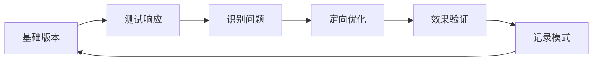

# 🎯 提示词工程技术指南

> 📚 从基础概念到实用技巧的完整提示词工程参考

---

## 🔍 核心概念速览

**提示词工程**是设计和优化输入提示的系统方法，目标是引导AI生成高质量、符合需求的输出。

### 📋 提示词基础组成

| 组成部分 | 功能 | 示例 |
|---------|-----|------|
| **🎯 任务指令** | 明确告知AI需要完成什么 | "翻译以下文本" |
| **📖 上下文** | 提供必要背景信息 | "你是金融领域专家" |
| **📄 输入数据** | 需要处理的具体内容 | "分析这段代码..." |
| **📊 输出格式** | 期望的回答形式 | "以JSON格式返回" |
| **💡 示例** | 展示预期输入-输出关系 | "输入X，期望输出Y" |
| **⚠️ 约束条件** | 明确生成的限制 | "不超过100字" |

---

## ⚡ 核心技术快速参考

| 技术 | 使用场景 | 提示模板 | 效果 |
|------|---------|---------|------|
| **零样本提示** | 简单明确任务 | `[问题]` | ⭐⭐⭐ |
| **少样本提示** | 复杂格式任务 | `示例1: 输入→输出\n示例2: 输入→输出\n问题:` | ⭐⭐⭐⭐ |
| **思维链(CoT)** | 数学、逻辑推理 | `问题: [问题]\n让我们一步一步思考:` | ⭐⭐⭐⭐⭐ |
| **思维树(ToT)** | 复杂决策、创意 | `问题: [问题]\n考虑多个思路: [列出选项]` | ⭐⭐⭐⭐ |
| **角色提示** | 专业领域分析 | `作为[角色]，[任务]` | ⭐⭐⭐⭐ |

---

## 🧠 高级思维技术详解

### 🔗 思维链技术 (Chain of Thought)

**原理**：引导模型显示推理过程，逐步分解复杂问题。

**基本模板**：
```
问题: [复杂问题描述]
让我们一步一步思考:
1. [第一步分析]
2. [第二步分析]
3. [得出结论]
```

**适用场景**：
- 🧮 数学计算和方程
- 🤔 逻辑推理和分析
- 📈 多步决策过程
- 📝 复杂文本理解

### 🌳 思维树技术 (Tree of Thought)

**原理**：探索多条并行推理路径，选择最优解决方案。

**实现模板**：
```
问题: [复杂问题]
构建思维树:

思路探索:
- 方案A: [描述]
- 方案B: [描述]  
- 方案C: [描述]

评估标准: [定义评估方法]
最优路径: [选择并深入最佳方案]
```

**适用场景**：
- 🎨 创造性问题解决
- 📋 策略规划
- ⚖️ 复杂决策权衡
- 🎮 策略游戏分析

---

## 🛠️ 实用技巧工具箱

### 📝 任务明确化技巧

| 策略 | 不佳示例 | 🎯 改进示例 |
|------|---------|------------|
| **动作词导向** | "关于X的信息" | "分析X的3个核心特征" |
| **量化约束** | "写文章" | "写800字科普文章" |
| **受众明确** | "解释概念" | "向高中生解释AI原理" |
| **标准设定** | "提供建议" | "提供符合SMART原则的建议" |

### 📊 结构化输出模板

```
以下列格式回答:

🎯 一句话总结: [核心要点]

📋 详细分析:
1. [要点一]
   - [支持细节]
2. [要点二]
   - [支持细节]

💡 结论: [行动建议]
```

### 🎭 角色提示框架

**CRISPE 框架**：
```
🎭 Capacity: 你是[专业角色]，专长于[领域]
📋 Role: 你的任务是[具体任务]
💡 Insight: 使用[方法/理论]分析
📝 Steps: 按以下步骤:
  1. [步骤1]
  2. [步骤2]
🎯 Purpose: 目标是[期望成果]
📊 Expect: 输出格式为[格式要求]
```

---

## 🎯 场景化应用模板

### 📄 内容创作
```
📝 任务: 写[类型]内容关于[主题]
👥 受众: [目标读者]
📏 要求: [字数]字，[语调]风格
📋 必含要素:
- [要素1]
- [要素2]
📊 格式: [具体格式要求]
```

### 💻 代码生成
```
🔧 功能: [详细功能描述]
⚙️ 语言: [编程语言]
📥 输入: [输入格式]
📤 输出: [期望输出]
🛡️ 异常: [错误处理需求]
📝 规范: 遵循[代码标准]，含注释
```

### 📊 数据分析
```
📈 数据: [数据描述]
🔍 任务: 分析并提供:
1. 关键统计指标
2. 主要趋势识别
3. 三个重要洞见:
   - 发现 + 数据支持 + 业务影响
📋 格式: 结构化报告
```

---

## ⚠️ 常见问题与解决方案

| 🚨 问题现象 | 🔍 可能原因 | ✅ 解决方案 |
|------------|------------|------------|
| 输出偏离主题 | 指令不够明确 | 使用具体动作词和约束 |
| 回答过短/过长 | 缺乏长度指导 | 明确指定字数或要点数 |
| 格式不统一 | 格式要求模糊 | 提供具体格式模板 |
| 专业性不足 | 角色设定不当 | 明确专业背景和角色 |
| 创意性不够 | 约束过多 | 减少限制，增加开放性 |

---

## 🔧 提示词优化检查清单

**基础检查**：
- [ ] ✅ 指令明确无歧义
- [ ] 📊 使用格式化增强可读性  
- [ ] 💡 包含充分示例（复杂任务）
- [ ] 🎯 明确输出约束和边界
- [ ] 🎭 角色定义清晰（如使用）

**高级检查**：
- [ ] 🔄 无内部矛盾指令
- [ ] 📈 多任务时标明优先级
- [ ] ⚖️ 平衡具体性和灵活性
- [ ] 🎯 针对具体使用场景优化

---

## 🚀 优化迭代流程



1. **🏗️ 基础版本**：创建包含核心任务的简单提示
2. **🧪 测试响应**：检查输出质量和符合度
3. **🔍 识别问题**：明确具体不足之处
4. **⚡ 定向优化**：针对性调整提示结构
5. **✅ 效果验证**：对比改进前后效果
6. **📚 记录模式**：保存有效模式供复用

---

## 🎯 核心设计原则

- **🎯 明确性**：避免模糊语言，使用精确指令
- **📏 具体性**：提供足够细节和边界约束
- **📊 结构化**：合理使用格式提升可读性
- **💡 示例化**：提供例子说明期望输出
- **🔄 迭代性**：根据结果持续优化改进

---

*💡 **快速上手建议**：先掌握基础模板，然后根据具体需求选择高级技术，最后通过迭代优化达到最佳效果。* 