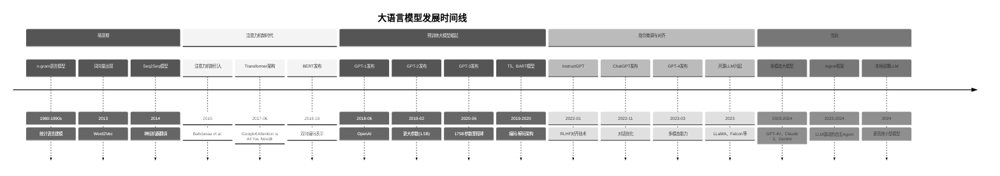
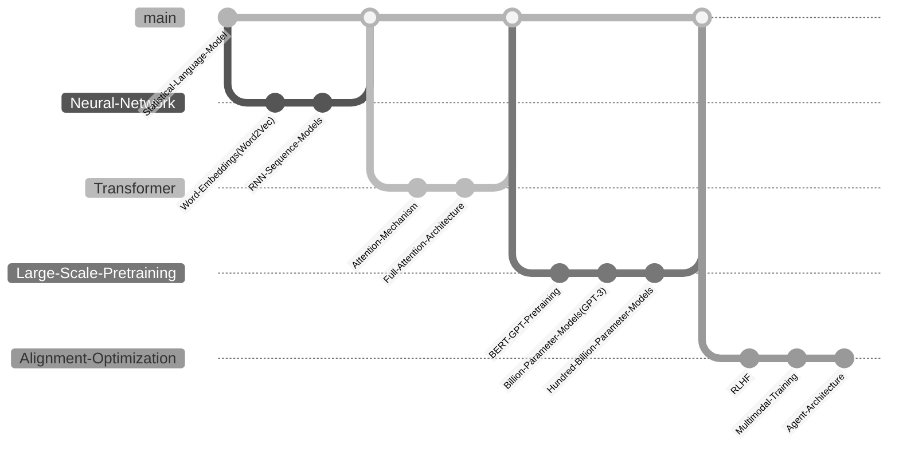
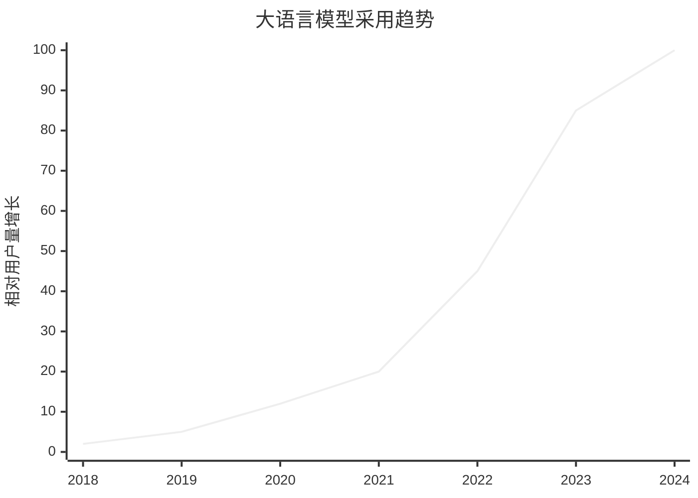
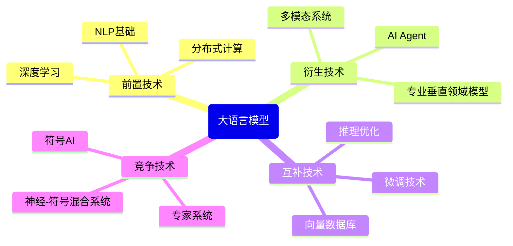

# 大语言模型技术演进时间线

## 📋 技术概述

**技术领域**：人工智能、自然语言处理、深度学习

**核心价值**：使计算机能够理解、生成和操作人类语言，实现各种语言任务的自动化，包括文本生成、翻译、摘要、问答和创意写作等

**主要竞争技术**：传统NLP方法、知识图谱、符号AI系统

## ⏳ 发展里程碑

## 📊 版本历史详情

### 主要模型发布

| 模型名称 | 发布日期 | 主要特性 | 参数规模 | 关键突破 |
|---------|---------|--------|---------|---------|
| Word2Vec | 2013-01 | 词向量表示 | - | 将单词映射到向量空间 |
| Transformer | 2017-06 | 自注意力机制 | 65M | 完全摒弃RNN，并行计算 |
| BERT | 2018-10 | 双向编码，预训练-微调范式 | 340M | 上下文理解，NLP任务SOTA |
| GPT-1 | 2018-06 | 单向自回归预训练 | 117M | 生成式预训练概念 |
| GPT-2 | 2019-02 | 零样本学习能力 | 1.5B | 无需任务特定训练的泛化能力 |
| T5 | 2019-10 | "Text-to-Text"框架 | 11B | 统一各种NLP任务 |
| GPT-3 | 2020-06 | 少样本学习能力 | 175B | 规模驱动的涌现能力 |
| InstructGPT | 2022-01 | RLHF人类反馈对齐 | 175B | 安全性和有用性提升 |
| ChatGPT | 2022-11 | 对话式交互 | 基于GPT-3.5 | 用户友好的聊天界面 |
| LLaMA | 2023-02 | 开源高效模型 | 7B-65B | 小模型高性能 |
| GPT-4 | 2023-03 | 多模态，推理能力提升 | 未披露 | 理解图像，推理复杂问题 |
| Claude 2/3 | 2023-07/2024-03 | 长上下文，安全性 | 未披露 | 文档理解，工具使用 |
| Gemini | 2023-12 | 多模态构建 | 未披露 | 从设计之初就支持多模态 |

### 关键技术转变

| 技术名称 | 首次应用时间 | 替代技术 | 影响 |
|---------|------------|---------|------|
| 注意力机制 | 2015 | RNN/LSTM | 解决长序列依赖问题 |
| Transformer | 2017 | CNN+RNN架构 | 并行计算，全局依赖建模 |
| 预训练-微调范式 | 2018 | 任务特定训练 | 知识迁移，降低下游任务数据需求 |
| 缩放定律 | 2020 | 架构创新 | 证明更大模型和数据量带来性能提升 |
| RLHF | 2022 | 有监督微调 | 通过人类反馈对齐模型输出 |
| 多模态训练 | 2023 | 单模态模型 | 整合文本、图像、视频等多种信息 |

## 🔄 技术范式转变

### 设计理念变迁

### 核心范式转变点

| 时间点 | 旧范式 | 新范式 | 转变驱动因素 | 影响 |
|-------|-------|-------|------------|------|
| 2013年 | 离散单词表示 | 分布式词向量 | 深度学习兴起 | 捕获单词语义相似性 |
| 2017年 | RNN序列处理 | Transformer架构 | 并行计算需求 | 彻底变革NLP模型架构 |
| 2018-2020年 | 任务特定训练 | 大规模预训练+微调 | 迁移学习研究 | 极大降低特定任务数据需求 |
| 2022年 | 无约束生成 | 人类偏好对齐 | 安全与实用性需求 | 提高模型输出质量和安全性 |
| 2023年 | 单模态文本模型 | 多模态统一模型 | 跨模态理解需求 | 扩展AI能力到图像、视频等 |

## 📈 流行度与采用情况

### 使用趋势

### 行业标准与认可

| 时间 | 标准/认可机构 | 影响 |
|------|--------------|------|
| 2019年 | SuperGLUE基准测试 | 建立NLP多任务评估标准 |
| 2021年 | Stanford HELM | 全面评估语言模型的框架 |
| 2022年 | GitHub Copilot采用 | 代码生成的行业认可 |
| 2023年 | 医疗监管机构开始评估AI | 医疗AI伦理与安全评估框架 |

## 🔍 关键影响因素

### 技术推动者

| 人物/组织 | 贡献 | 影响时期 |
|----------|------|---------|
| Tomas Mikolov | Word2Vec | 2013-2015 |
| Vaswani等(Google) | Transformer架构 | 2017-至今 |
| OpenAI团队 | GPT系列模型 | 2018-至今 |
| Google DeepMind | Gemini多模态系统 | 2023-至今 |
| Meta AI | LLaMA开源模型 | 2023-至今 |

### 市场/社区因素

| 因素 | 影响 | 时间点 |
|------|------|-------|
| 计算资源可用性 | 促进大规模训练 | 2018-2020 |
| ChatGPT用户体验 | 大众采用LLM | 2022-2023 |
| 开源社区 | 民主化LLM开发 | 2023-至今 |
| 投资热潮 | 加速商业应用 | 2023-2024 |
| 监管关注 | 影响安全与伦理发展方向 | 2023-至今 |

## 🧩 与相关技术的关系

### 技术生态系统

### 重要集成与互操作

| 相关技术 | 关系类型 | 集成点 | 参考资料 |
|---------|---------|-------|---------|
| 向量数据库 | 互补 | 知识检索增强 | [[RAG架构设计]] |
| 精细微调 | 互补 | 专业领域适应 | [[PEFT微调技术]] |
| 模型量化 | 互补 | 推理效率 | [[LLM量化与优化]] |
| 多模态感知 | 扩展 | 视觉理解 | [[多模态LLM架构]] |

## 📚 技术演进教训

### 成功因素

1. 规模定律的验证 - 更大的模型、更多的数据和计算带来性能飞跃
2. 自监督学习减少了对标注数据的依赖
3. 架构简化（如Transformer）比复杂设计更可扩展
4. 重视人类反馈对齐带来实用性提升

### 挑战与教训

1. 模型解释性困难，黑盒特性带来可靠性问题
2. 数据质量比数据量更重要的认识逐渐形成
3. 计算资源不平等导致技术集中于少数机构
4. 幻觉问题证明纯统计方法存在固有局限性

## 🔮 未来发展预测

### 近期演进方向

| 预期发展 | 可能时间点 | 影响分析 | 准备策略 |
|---------|-----------|---------|---------|
| 更高效小型模型 | 2024-2025 | 降低部署门槛 | 关注模型压缩技术 |
| 专业领域垂直模型 | 2024-2025 | 特定行业应用更精准 | 收集高质量领域数据 |
| 多模态融合深化 | 2024-2025 | 更全面的世界理解 | 学习跨模态表示方法 |
| 推理能力增强 | 2024-2026 | 减少逻辑错误和幻觉 | 研究知识图谱集成 |

### 长期趋势

| 趋势预测 | 指标迹象 | 战略考量 |
|---------|---------|---------|
| 神经-符号混合系统 | 当前LLM推理局限性 | 关注形式逻辑与LLM结合 |
| 持续学习架构 | 静态模型知识过期问题 | 探索在线学习方法 |
| 多Agent协作系统 | LLM作为Agent基础设施的研究 | 学习多智能体系统设计 |
| 自主AI系统 | 工具使用与规划能力提升 | 建立安全监管机制 |

## 🔗 相关资源

### 官方资源

- [OpenAI研究博客](https://openai.com/research/)
- [Google AI Blog](https://ai.google/research/blog/)
- [Anthropic Claude文档](https://www.anthropic.com/claude)

### 学习资源

- [[大语言模型基础教程]]
- [[Transformer架构详解]]
- [Hugging Face课程](https://huggingface.co/learn)

### 社区资源

- [Papers with Code LLM部分](https://paperswithcode.com/task/language-modelling)
- [EleutherAI社区](https://www.eleuther.ai/)
- [LMSys排行榜](https://chat.lmsys.org/)

## 🔄 更新记录

- 2025-05-09 - 创建大语言模型技术演进时间线 