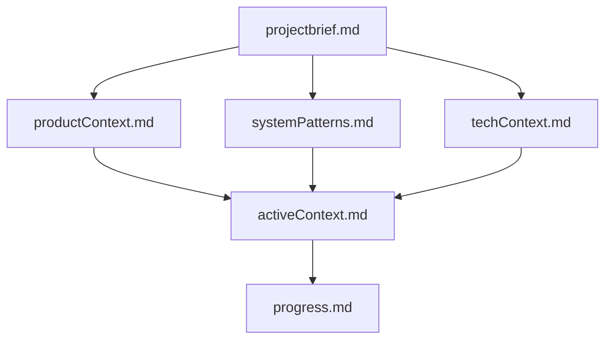
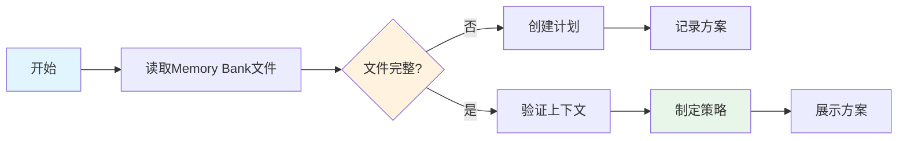
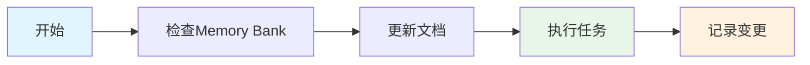

# Cline Memory Bank Cheatsheet

## 核心概念

Memory Bank是一个结构化的文档系统,使Cline能够跨会话维持上下文。它通过在项目中维护一系列Markdown文件来保存项目知识。



## 核心文件结构

1. **projectbrief.md**
   - 项目基础文档
   - 定义核心需求和目标
   - 项目范围的真实来源
   
   示例:
   ```markdown
   # 项目简介
   构建一个React库存管理系统,支持条码扫描功能。
   
   ## 核心需求
   - 多仓库支持
   - 实时库存更新
   - 移动设备友好
   ```

2. **productContext.md**
   - 项目存在的原因
   - 解决的问题
   - 产品如何工作
   - 用户体验目标
   
   示例:
   ```markdown
   # 产品背景
   现有库存管理系统存在延迟问题，无法支持多仓库协同。

   ## 解决方案
   - 实时数据同步架构
   - 分布式仓库管理
   - 移动优先的UI设计
   ```

3. **activeContext.md** (最常更新)
   - 当前工作重点
   - 最近的更改
   - 下一步计划
   - 重要模式和见解
   
   示例:
   ```markdown
   # 当前状态
   正在实现条码扫描组件。

   ## 最近更改
   - 完成API集成
   - 优化扫描性能
   - 添加错误处理

   ## 下一步
   - 实现批量扫描
   - 添加离线模式
   ```

4. **systemPatterns.md**
   - 系统架构
   - 关键技术决策
   - 设计模式使用
   - 组件关系
   
   示例:
   ```markdown
   # 系统架构
   采用微服务架构，前后端分离。

   ## 设计模式
   - 仓库模式：状态管理
   - 观察者模式：实时更新
   - 策略模式：多仓库路由

   ## 技术栈选择原因
   - React: 组件复用，性能优化
   - GraphQL: 灵活数据查询
   ```

5. **techContext.md**
   - 使用的技术栈
   - 开发环境设置
   - 技术约束
   - 依赖关系
   
   示例:
   ```markdown
   # 技术栈
   - React 18
   - TypeScript 5
   - Firebase
   - Jest

   ## 开发环境
   - Node >= 18
   - npm >= 9
   - VSCode配置已同步
   ```

6. **progress.md**
   - 已完成功能
   - 待实现内容
   - 当前状态
   - 已知问题
   
   示例:
   ```markdown
   # 项目进度
   
   ## 已完成 (80%)
   - ✅ 用户认证
   - ✅ 基础UI
   - ✅ API集成
   
   ## 进行中 (15%)
   - 🟡 条码扫描
   - 🟡 离线模式
   
   ## 待开始 (5%)
   - ⭕️ 报表系统
   - ⭕️ 性能优化
   ```
   
## 扩展上下文文件

根据项目需要可以创建额外的文档:

1. **features/** - 复杂功能文档
   ```markdown
   features/
   ├── barcode-scanning.md  # 条码扫描实现细节
   ├── inventory-sync.md    # 库存同步机制
   └── reporting.md        # 报表生成系统
   ```

2. **api/** - API文档
   ```markdown
   api/
   ├── endpoints.md    # API端点描述
   ├── models.md      # 数据模型
   └── examples.md    # 使用示例
   ```

3. **deployment/** - 部署文档
   ```markdown
   deployment/
   ├── setup.md       # 环境设置
   ├── docker.md      # 容器配置
   └── monitoring.md  # 监控方案
   ```

## 工作流程

### Plan模式工作流


### Act模式工作流


## 常用命令

### 基础命令
- `follow your custom instructions` - 读取Memory Bank并继续工作
- `initialize memory bank` - 初始化新项目
- `update memory bank` - 触发完整文档审查和更新

### 典型使用场景

1. **初始化新项目**
   ```bash
   # 1. 创建Memory Bank配置
   新建 .clinerules 文件或设置Custom Instructions
   
   # 2. 初始化项目
   > initialize memory bank
   
   # 3. 确认所有文件已创建
   > follow your custom instructions
   ```

2. **日常工作流**
   ```bash
   # 1. 开始新任务时
   > follow your custom instructions
   
   # 2. 完成重要更改后
   > update memory bank
   
   # 3. 上下文窗口接近限制时
   > update memory bank
   > [开始新对话]
   > follow your custom instructions
   ```

3. **切换工作模式**
   ```bash
   # 规划新功能
   > switch to plan mode
   
   # 开始实现
   > switch to act mode
   ```

## 最佳实践

1. **文档更新时机**
   - 发现新的项目模式时
   - 实施重大更改后
   - 使用update memory bank命令时
   - 需要澄清上下文时

2. **上下文窗口管理**
   - 当对话变慢时:
     1. 使用"update memory bank"保存状态
     2. 开始新对话
     3. 使用"follow your custom instructions"恢复上下文

3. **项目启动**
   - 从基本项目简介开始
   - 让结构自然演进
   - 根据工作流程调整文件

4. **持续工作**
   - 让模式自然形成
   - 文档更新应该是有机的
   - 每次会话开始时确认上下文

## 配置方式

1. **全局配置** (Custom Instructions)
   - VSCode Cline扩展设置
   - 适用于所有项目

2. **项目配置** (.clinerules)
   - 在项目根目录创建
   - 仅适用于特定项目

## 注意事项

- Memory Bank是Cline连接之前工作的唯一方式
- 必须在每个任务开始时阅读所有Memory Bank文件
- 文档必须保持精确和清晰
- 支持任何类型的项目(不仅限于编程)
- 可以与其他AI工具配合使用
