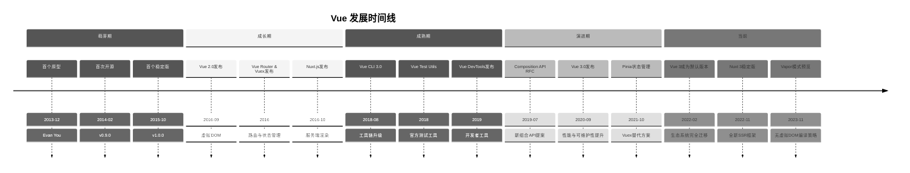
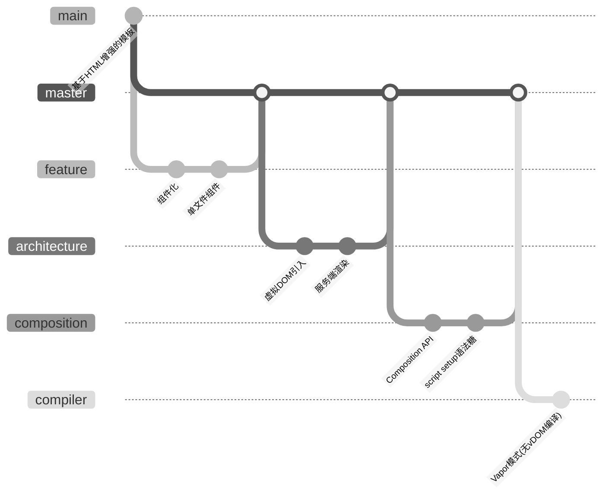
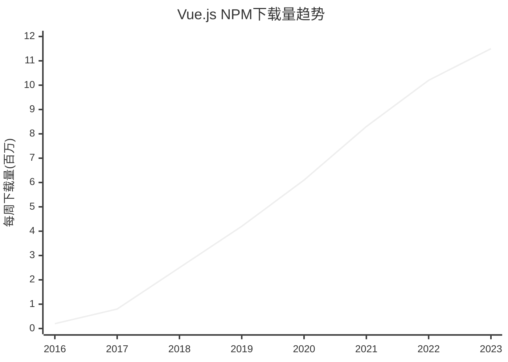
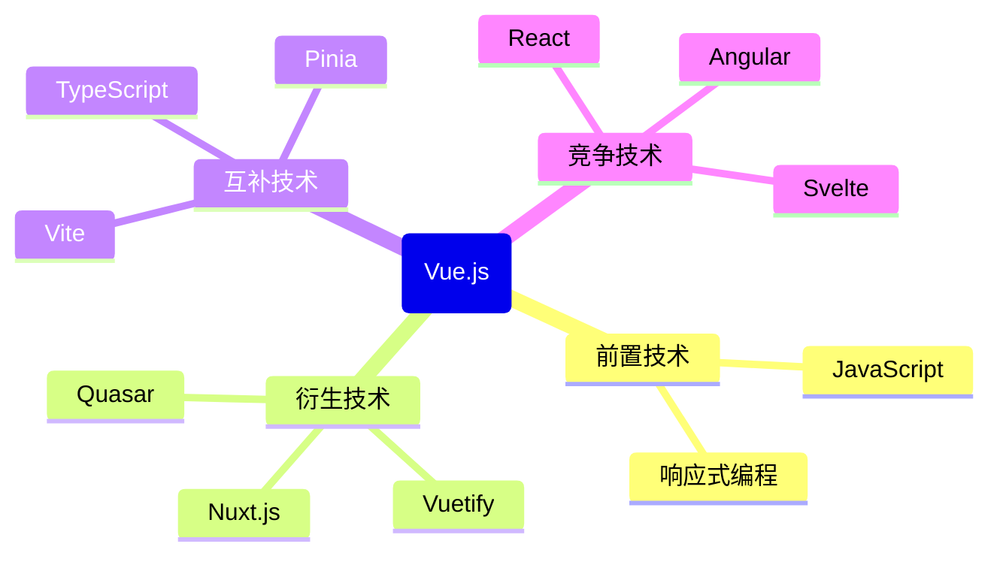

# Vue技术演进时间线

## 📋 技术概述

**技术领域**：前端JavaScript渐进式框架

**核心价值**：提供易于使用且灵活的渐进式JavaScript框架，允许开发者以低门槛开始，并随着需求增长扩展为全特性框架

**主要竞争技术**：React, Angular, Svelte

## ⏳ 发展里程碑

## 📊 版本历史详情

### 主要版本发布

| 版本号 | 发布日期 | 主要特性 | 重大变化 | 兼容性 |
|-------|---------|--------|---------|-------|
| v0.9.0 | 2014-02 | 首次发布，基本响应式系统 | - | - |
| v1.0.0 | 2015-10-26 | 完整的组件系统，过渡效果 | API稳定 | - |
| v2.0.0 | 2016-09-30 | 虚拟DOM，服务端渲染，JSX支持 | 完全重写渲染层 | 部分不兼容v1 |
| v2.5.0 | 2017-10-13 | 改进TypeScript支持 | - | 完全兼容v2 |
| v2.6.0 | 2019-02-04 | 插槽语法改进，异步错误处理 | 新的v-slot语法 | 大部分兼容 |
| v3.0.0 | 2020-09-18 | Composition API，Teleport，Fragments | 重写响应式系统 | 需迁移工作 |
| v3.2.0 | 2021-08-05 | script setup语法，CSS变量注入 | - | 完全兼容v3 |
| v3.3.0 | 2023-05-08 | defineModel，改进响应式性能 | - | 完全兼容v3 |

### 弃用特性与迁移路径

| 弃用特性 | 弃用版本 | 替代方案 | 迁移指南 |
|---------|---------|---------|---------|
| Filters | v3.0 | 计算属性或方法 | [移除过滤器](https://v3-migration.vuejs.org/breaking-changes/filters.html) |
| $listeners | v3.0 | $attrs统一属性 | [移除$listeners](https://v3-migration.vuejs.org/breaking-changes/listeners-removed.html) |
| Vue.extend | v3.0 | defineComponent | [组件定义迁移](https://v3-migration.vuejs.org/breaking-changes/global-api.html) |
| Mixins | v3.0 | Composition API | [从Mixins迁移](https://vuejs.org/guide/reusability/composables.html) |

## 🔄 技术范式转变

### 设计理念变迁

### 核心范式转变点

| 时间点 | 旧范式 | 新范式 | 转变驱动因素 | 影响 |
|-------|-------|-------|------------|------|
| 2016年 | 简单DOM模板增强 | 完整的虚拟DOM | 复杂应用性能瓶颈 | 使Vue能处理更复杂的应用 |
| 2018年 | 配置对象API | 基于函数的组合API (RFC) | 代码组织和复用问题 | 改变代码组织方式，提升可维护性 |
| 2020年 | Options API | Composition API | 大型项目中的代码组织 | 提供更灵活的逻辑复用模式 |
| 2023年 | 虚拟DOM | 编译优化 (Vapor) | 性能优化需求 | 潜在的大幅性能提升 |

## 📈 流行度与采用情况

### 使用趋势

### 行业标准与认可

| 时间    | 标准/认可机构            | 影响                |
| ----- | ------------------ | ----------------- |
| 2018年 | State of JS调查      | Vue满意度评分最高的前端框架   |
| 2020年 | GitHub Octoverse报告 | Vue成为前10大开源项目之一   |
| 2022年 | StackOverflow调查    | Vue持续保持最受欢迎框架前五位置 |

## 🔍 关键影响因素

### 技术推动者

| 人物/组织 | 贡献 | 影响时期 |
|----------|------|---------|
| Evan You | Vue创始人与核心维护者 | 2013-至今 |
| Sarah Drasner | 核心团队成员，教育内容 | 2016-2022 |
| Damian Dulisz | Vue生态系统贡献者 | 2016-2020 |
| Eduardo San Martin Morote | 核心团队，Vue Router维护者 | 2017-至今 |

### 市场/社区因素

| 因素 | 影响 | 时间点 |
|------|------|-------|
| 企业采用 | 阿里巴巴等大型企业采用促进增长 | 2017-2019 |
| 低入门门槛 | 简单易学推动初学者采用 | 2015-至今 |
| React复杂性 | React学习曲线陡峭推动开发者转向Vue | 2016-2018 |
| 后端开发者 | Laravel等后端框架官方支持Vue | 2017-至今 |

## 🧩 与相关技术的关系

### 技术生态系统

### 重要集成与互操作

| 相关技术 | 关系类型 | 集成点 | 参考资料 |
|---------|---------|-------|---------|
| TypeScript | 互补 | 类型系统支持 | [[Vue与TypeScript集成指南]] |
| Vite | 互补 | 构建工具 | [Vite官方文档](https://vitejs.dev/guide/) |
| Laravel | 生态系统 | 后端框架整合 | [Laravel与Vue](https://laravel.com/docs/frontend) |
| GraphQL | 互补 | 数据获取 | [[Vue Apollo指南]] |

## 📚 技术演进教训

### 成功因素

1. 渐进式采用策略使开发者可以逐步学习和应用
2. 优秀的文档和学习资源降低了入门门槛
3. 平衡灵活性和开发体验，不强制特定开发模式
4. 借鉴竞争技术的优点，保持演进但不盲目追随

### 挑战与教训

1. Vue 2到Vue 3的迁移过程延长，导致生态系统分裂
2. 长期依赖单一核心维护者(Evan You)带来的可持续性风险
3. 与React相比，在欧美企业环境中采用率相对较低
4. 一些早期API设计决策限制了后期的架构灵活性

## 🔮 未来发展预测

### 近期演进方向

| 预期发展 | 可能时间点 | 影响分析 | 准备策略 |
|---------|-----------|---------|---------|
| Vapor模式稳定版发布 | 2024 | 显著提升性能 | 关注编译策略优化 |
| 与Web Components更深度整合 | 2024-2025 | 提高组件复用性 | 学习Web Components标准 |
| 更强大的TypeScript集成 | 2024 | 改善开发体验 | 加强TypeScript知识 |

### 长期趋势

| 趋势预测 | 指标迹象 | 战略考量 |
|---------|---------|---------|
| 更多编译时优化 | Vapor模式研究方向 | 关注编译优化技术 |
| 服务器组件模式普及 | Nuxt生态系统发展 | 学习全栈开发模式 |
| AI辅助Vue开发 | 早期工具如VueDX | 跟踪AI编码助手发展 |

## 🔗 相关资源

### 官方资源

- [Vue.js官方网站](https://vuejs.org/)
- [Vue.js GitHub仓库](https://github.com/vuejs/core)
- [Vue.js官方教程](https://vuejs.org/tutorial/)

### 学习资源

- [[Vue.js基础教程]]
- [[Vue组合式API完全指南]]
- [Vue Mastery课程](https://www.vuemastery.com/)

### 社区资源

- [Vue.js论坛](https://forum.vuejs.org/)
- [Vue Land (Discord)](https://chat.vuejs.org/)
- [Stack Overflow Vue标签](https://stackoverflow.com/questions/tagged/vue.js)

## 🔄 更新记录

- 2025-05-09 - 创建Vue技术演进时间线 