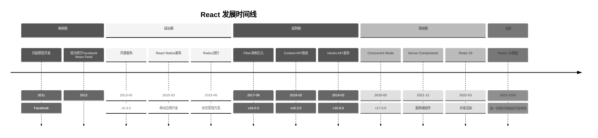
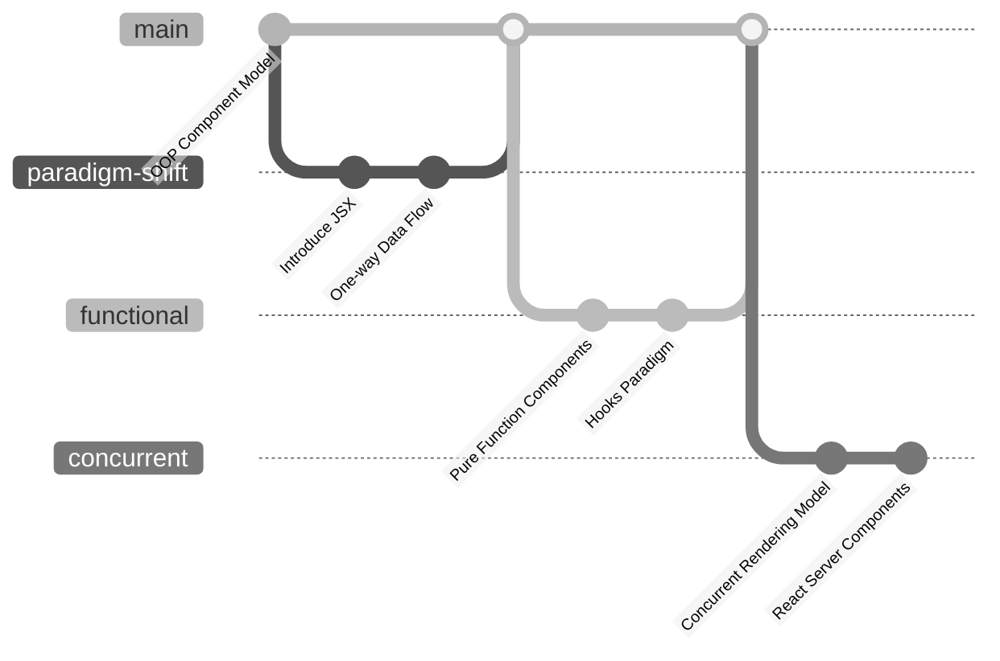
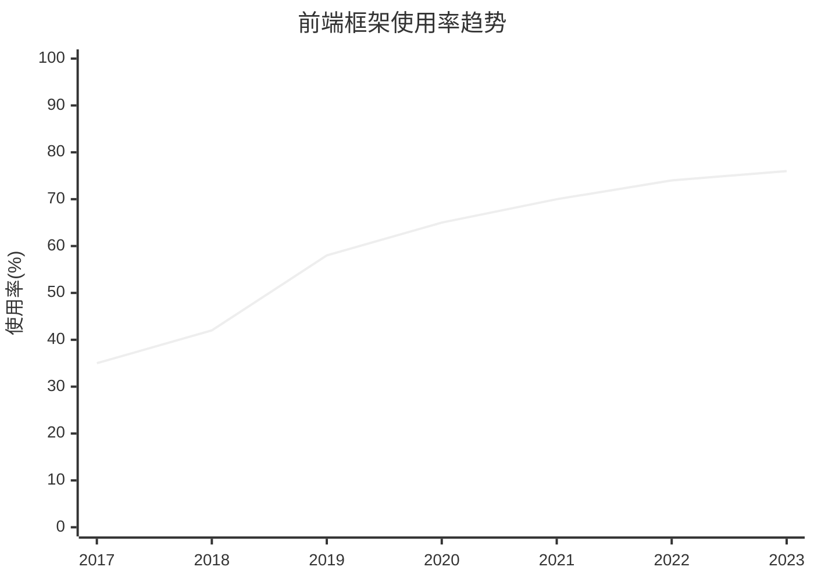
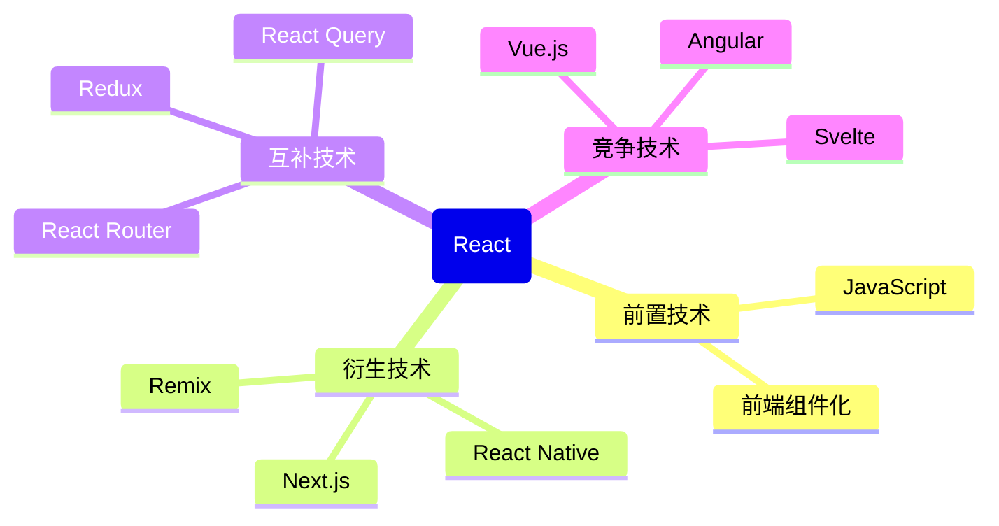

# React技术演进时间线

## 📋 技术概述

**技术领域**：前端JavaScript UI库/框架

**核心价值**：通过组件化思想和虚拟DOM提供高效的UI开发方式，使开发者可以构建大型、复杂的交互式用户界面

**主要竞争技术**：Angular, Vue.js, Svelte

## ⏳ 发展里程碑

## 📊 版本历史详情

### 主要版本发布

| 版本号 | 发布日期 | 主要特性 | 重大变化 | 兼容性 |
|-------|---------|--------|---------|-------|
| v0.3.0 | 2013-05-29 | 首次公开发布 | - | - |
| v0.14.0 | 2015-10-07 | 将React拆分为react和react-dom | DOM操作移至react-dom | 需更新引用 |
| v15.0.0 | 2016-04-07 | 改进渲染速度 | 弃用部分内部API | 好 |
| v16.0.0 | 2017-09-26 | Fiber架构、Error Boundaries、Portals | 完全重写核心算法 | 大部分兼容 |
| v16.3.0 | 2018-03-29 | 新Context API、createRef API | 开始移除旧Context API | 有弃用警告 |
| v16.8.0 | 2019-02-06 | Hooks API | 函数组件引入状态 | 完全兼容 |
| v17.0.0 | 2020-10-20 | 渐进式升级支持 | 移除事件池 | 良好 |
| v18.0.0 | 2022-03-29 | 并发渲染、Suspense改进、自动批处理 | 并发特性处理异步更新 | 需小幅调整 |

### 弃用特性与迁移路径

| 弃用特性 | 弃用版本 | 替代方案 | 迁移指南 |
|---------|---------|---------|---------|
| 旧Context API | v16.3 | 新Context API | [迁移Context API](https://reactjs.org/docs/context.html) |
| 生命周期方法 | v16.3 | 新的生命周期方法 | [生命周期迁移](https://reactjs.org/blog/2018/03/27/update-on-async-rendering.html) |
| Mixins | v15.5 | 高阶组件、Hooks | [从Mixins迁移](https://reactjs.org/blog/2016/07/13/mixins-considered-harmful.html) |
| React.createClass | v15.5 | ES6 class组件 | [迁移到ES6类](https://reactjs.org/docs/react-without-es6.html) |

## 🔄 技术范式转变

### 设计理念变迁

### 核心范式转变点

| 时间点 | 旧范式 | 新范式 | 转变驱动因素 | 影响 |
|-------|-------|-------|------------|------|
| 2015年 | 命令式DOM操作 | 声明式UI描述 | DOM操作复杂性 | 极大简化UI开发 |
| 2016年 | mixins共享代码 | 组合优于继承 | mixins复杂度高 | 提高组件复用性 |
| 2019年 | 类组件 | 函数组件+Hooks | 类组件逻辑复用困难 | 彻底改变组件设计思想 |
| 2022年 | 同步渲染 | 并发渲染 | 大型应用性能瓶颈 | 提高应用响应速度 |

## 📈 流行度与采用情况

### 使用趋势

### 行业标准与认可

| 时间 | 标准/认可机构 | 影响 |
|------|--------------|------|
| 2015年 | JavaScript Standards | React JSX影响了JavaScript社区组件设计思想 |
| 2019年 | StackOverflow调查 | React成为最受欢迎前端框架第一名 |
| 2021年 | State of JS | React连续四年保持最高满意度和使用率 |

## 🔍 关键影响因素

### 技术推动者

| 人物/组织 | 贡献 | 影响时期 |
|----------|------|---------|
| Jordan Walke | React创始人 | 2011-2013 |
| Dan Abramov | Redux创建者，React核心团队 | 2015-至今 |
| Sophie Alpert | React团队前负责人 | 2016-2019 |
| Sebastian Markbåge | React架构师 | 2014-至今 |

### 市场/社区因素

| 因素 | 影响 | 时间点 |
|------|------|-------|
| 移动应用增长 | 推动React Native发展 | 2015-2018 |
| 大型单页应用需求 | 推动状态管理解决方案 | 2015-2017 |
| 开发者体验优先 | 促进Hooks API开发 | 2018-2019 |
| 微前端架构兴起 | 影响React组件设计 | 2019-至今 |

## 🧩 与相关技术的关系

### 技术生态系统

### 重要集成与互操作

| 相关技术 | 关系类型 | 集成点 | 参考资料 |
|---------|---------|-------|---------|
| TypeScript | 互补 | 类型系统增强 | [[TypeScript与React集成指南]] |
| GraphQL | 互补 | 数据获取 | [Apollo React官方文档](https://www.apollographql.com/docs/react/) |
| Webpack | 构建工具 | 打包与优化 | [[React应用打包优化]] |
| Jest | 测试框架 | 组件测试 | [React测试文档](https://reactjs.org/docs/testing.html) |

## 📚 技术演进教训

### 成功因素

1. 组件化思想彻底改变前端开发方式
2. 虚拟DOM抽象屏蔽底层复杂性
3. 渐进式更新策略，保持向后兼容
4. 开源社区与企业支持的结合

### 挑战与教训

1. 早期文档和学习资源不足，导致入门门槛高
2. 状态管理方案过多导致的生态系统碎片化
3. 类组件API设计导致的逻辑复用困难
4. 并发模式概念复杂，开发者理解障碍

## 🔮 未来发展预测

### 近期演进方向

| 预期发展 | 可能时间点 | 影响分析 | 准备策略 |
|---------|-----------|---------|---------|
| React Server Components普及 | 2023-2024 | 改变前后端分工 | 学习相关框架如Next.js |
| Compiler优化 | 2024 | 运行时性能提升 | 关注React编译策略变化 |
| Suspense for Data Fetching | 2023-2024 | 简化数据加载 | 熟悉Suspense机制 |

### 长期趋势

| 趋势预测 | 指标迹象 | 战略考量 |
|---------|---------|---------|
| 全栈框架整合 | Next.js/Remix采用率提升 | 向全栈开发者转型 |
| AI辅助组件开发 | React+AI工具实验项目增多 | 关注AI代码生成工具发展 |
| 编译时优化替代运行时 | React团队compiler研究方向 | 深入学习编译原理 |

## 🔗 相关资源

### 官方资源

- [React官方网站](https://reactjs.org/)
- [React GitHub仓库](https://github.com/facebook/react)
- [React博客](https://reactjs.org/blog/)

### 学习资源

- [[React基础教程]]
- [[React Hooks深入指南]]
- [React开发者路线图](https://roadmap.sh/react)

### 社区资源

- [React Dev社区](https://dev.to/t/react)
- [React Reddit社区](https://www.reddit.com/r/reactjs/)
- [Stack Overflow React标签](https://stackoverflow.com/questions/tagged/reactjs)

## 🔄 更新记录

- 2025-05-09 - 创建React技术演进时间线 