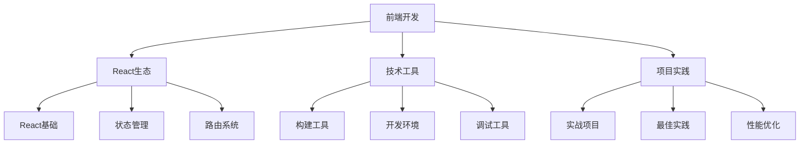

# 🗺️ 知识地图

> **按主题聚合的知识网络** - 探索知识间的关联

## 🚀 2分钟速览
- 最近更新：[[../../20-areas/20-02-AI/00-MOC-AI研究|AI研究]] | [[../../20-areas/20-03-前端开发/00-MOC-前端开发|前端开发]] | [[../../20-areas/20-01-提示词工程/00-MOC-提示词工程|提示词工程]]
- 待办事项：[[10-项目看板|查看项目]] | [[99-维护面板|系统维护]]
- 常用资源：[[30-工具箱|工具箱]] | [[00-快速导航|快速导航]]

## 🌐 知识全景

### 🎯 核心技术领域

#### 💻 前端开发生态


- **核心入口**：[[../../20-areas/20-03-前端开发/00-MOC-前端开发|前端开发]]
- **技术栈**：[[../../30-resources/30-01-前端技术/00-MOC-前端技术|前端技术资源]]
- **React专题**：[[../../30-resources/30-01-前端技术/02-React/00-MOC-React|React学习]]
- **常用堆栈**：[[../../30-resources/30-01-前端技术/03-常用堆栈/00-MOC-常用堆栈|技术堆栈]]

#### 🤖 AI研究与应用
- **AI研究中心**：[[../../20-areas/20-02-AI/00-MOC-AI研究|AI研究]]
- **提示词工程**：[[../../20-areas/20-01-提示词工程/00-MOC-提示词工程|提示词工程]]
- **AI工具应用**：[[../../20-areas/20-02-AI/01-AI工具使用/00-MOC-AI工具|AI工具]]
- **AI资源库**：[[../../30-resources/30-02-AI资源/00-MOC-AI资源|AI资源]]
- **AI阅读清单**：[[../../30-resources/30-02-AI资源/01-MOC-AI阅读|AI阅读]]

#### 🧠 方法论与思维
- **思维体系**：[[../../20-areas/20-00-方法论与思维/00-MOC-方法论|方法论]]
- **学习方法**：[[../../20-areas/20-00-方法论与思维/学习方法/00-MOC-学习方法|学习方法]]
- **思维模型**：[[../../20-areas/20-00-方法论与思维/MOC-思维模型|思维模型]]
- **生产力系统**：[[../../20-areas/20-00-方法论与思维/MOC-生产力|生产力]]

### 🛠️ 工具与技术

#### ⚙️ 开发工具链
- **工具指南**：[[../../30-resources/30-05-工具指南/00-MOC-工具指南|工具指南]]
- **开发工具**：[[../../30-resources/30-05-工具指南/00-MOC-开发工具|开发工具]]
- **技术指南**：[[../../30-resources/30-03-技术指南/00-MOC-技术指南|技术指南]]

#### 🔌 MCP生态
- **MCP资源**：[[../../20-areas/20-02-AI/00-MCP相关资源|MCP相关资源]]
- **MCP工具应用**
- **MCP开发实践**

#### 🖥️ Node.js后端
- **核心概念**：[[../../20-areas/20-04-Nodejs/核心概念/00-MOC-Nodejs核心概念|Node.js核心]]

## 📚 知识层次结构

### 🎓 学习路径

#### 前端开发学习路径
1. **基础阶段**
   - HTML/CSS 基础
   - JavaScript 核心概念
   - 前端工具链认知

2. **进阶阶段**
   - React 框架掌握
   - 状态管理理解
   - 构建工具使用

3. **专家阶段**
   - 性能优化策略
   - 架构设计能力
   - 团队协作实践

#### AI应用学习路径
1. **工具使用**
   - AI工具熟练应用
   - 提示词技巧掌握
   - 场景化应用实践

2. **深度理解**
   - AI原理认知
   - 模型特性理解
   - 限制与边界认知

3. **创新应用**
   - 工作流程优化
   - 创新应用场景
   - 跨领域应用

### 🔗 知识关联图

#### 高频关联主题
```dataview
TABLE WITHOUT ID
	file.link as "主题",
	length(file.outlinks) as "出链数",
	length(file.inlinks) as "入链数",
	length(file.outlinks) + length(file.inlinks) as "总关联度"
FROM "20-areas" OR "30-resources"
WHERE type = "moc"
SORT (length(file.outlinks) + length(file.inlinks)) DESC
LIMIT 10
```

#### 主题标签分布
```dataview
TABLE WITHOUT ID
	choice(contains(string(tags), "topic/ai"), "🤖 AI", 
		   contains(string(tags), "topic/frontend"), "💻 前端",
		   contains(string(tags), "topic/tools"), "🛠️ 工具",
		   contains(string(tags), "topic/learning"), "📚 学习",
		   "📋 其他") as "领域",
	length(rows) as "笔记数量"
FROM "20-areas" OR "30-resources"
GROUP BY choice(contains(string(tags), "topic/ai"), "🤖 AI", 
		   contains(string(tags), "topic/frontend"), "💻 前端",
		   contains(string(tags), "topic/tools"), "🛠️ 工具",
		   contains(string(tags), "topic/learning"), "📚 学习",
		   "📋 其他")
SORT length(rows) DESC
```

## 🔍 探索工具

### 按主题浏览
- `#topic/ai` - AI相关内容
- `#topic/frontend` - 前端开发
- `#topic/tools` - 工具使用
- `#topic/learning` - 学习方法
- `#topic/productivity` - 生产力

### 按状态筛选
- `#status/active` - 活跃内容
- `#status/draft` - 草稿状态
- `#status/archived` - 已归档
- `#status/review` - 待审核

### 按行动分类
- `#action/todo` - 待办事项
- `#action/reading` - 待阅读
- `#action/practice` - 待实践
- `#action/review` - 待回顾

## 📊 知识健康度

### 连接度分析

#### 孤岛笔记（无连接）
```dataview
LIST
FROM "20-areas" OR "30-resources"
WHERE length(file.outlinks) = 0 AND length(file.inlinks) = 0
LIMIT 10
```

#### 高连接度笔记（知识枢纽）
```dataview
TABLE WITHOUT ID
	file.link as "笔记",
	length(file.outlinks) as "出链",
	length(file.inlinks) as "入链"
FROM "20-areas" OR "30-resources"
WHERE length(file.outlinks) + length(file.inlinks) > 5
SORT length(file.outlinks) + length(file.inlinks) DESC
LIMIT 10
```

### 更新活跃度

#### 最近活跃主题
```dataview
TABLE WITHOUT ID
	file.link as "主题",
	updated as "最近更新",
	date(today) - date(updated) as "距今天数"
FROM "20-areas" OR "30-resources"  
WHERE type = "moc"
SORT updated DESC
LIMIT 8
```

#### 需要关注的主题（长期未更新）
```dataview
LIST
FROM "20-areas" OR "30-resources"
WHERE type = "moc" AND date(today) - date(updated) > dur(30 days)
SORT updated ASC
LIMIT 5
```

## 🌱 知识成长

### 新兴主题识别
- 观察标签使用频率变化
- 识别新的知识连接模式
- 发现跨领域关联机会

### 知识深化方向
- 增强主题间的关联
- 完善知识结构层次
- 提升内容质量深度

---

> [!note] 使用建议
> - 🗺️ 定期浏览知识地图，发现新的学习机会
> - 🔗 注意建立跨主题的知识连接
> - 📊 关注知识健康度指标，保持知识库活力 