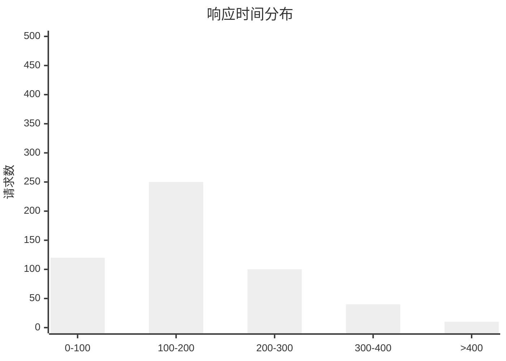
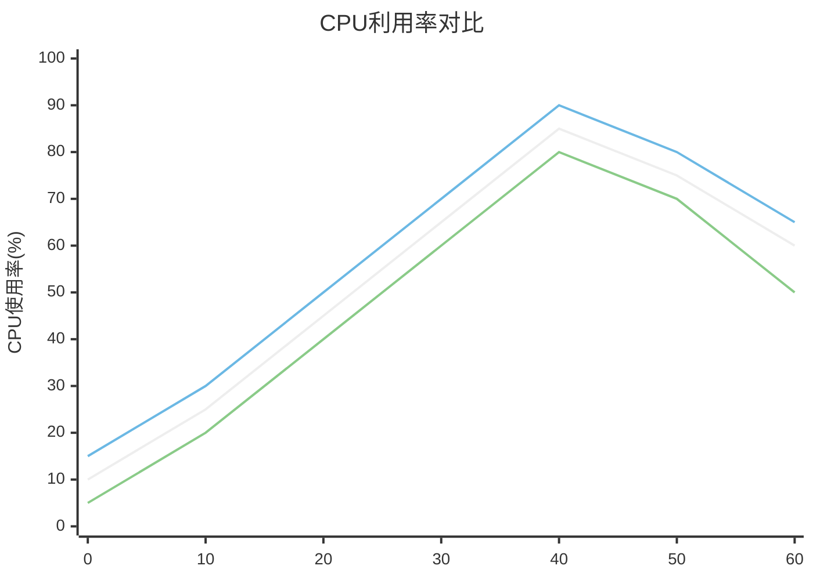
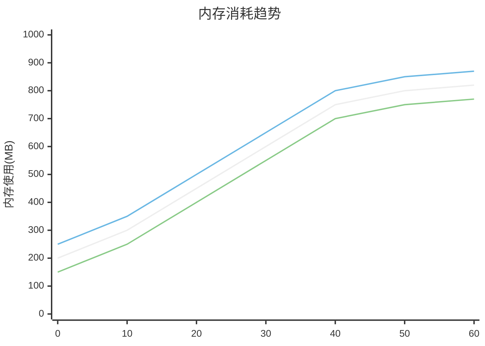
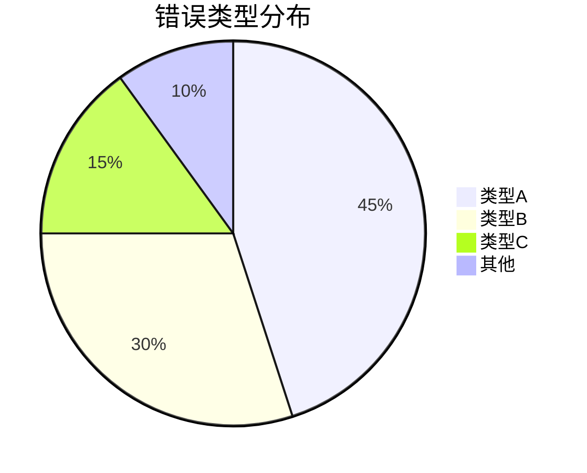

# <% tp.file.title %>

## 📊 实验结果概述

**分析目的**：
<!-- 简要描述结果分析与比较的目的 -->

**相关实验**：
<% tp.frontmatter.experiments.map(exp => `- [[${exp}]]`).join('\n') %>

**分析日期**：<% tp.date.now("YYYY-MM-DD") %>

## 📈 关键指标对比

### 性能指标

```mermaid
%%{init: {
  "theme": "neutral",
  "themeVariables": {
    "primaryColor": "#f4f4f4",
    "primaryTextColor": "#333",
    "primaryBorderColor": "#ddd",
    "lineColor": "#666",
    "secondaryColor": "#eee",
    "tertiaryColor": "#fff"
  }
}}%%
xychart-beta
    title "性能对比"
    x-axis [实验1, 实验2, 实验3]
    y-axis "执行时间(ms)" 0 --> 1000
    bar [750, 620, 450]
    line [750, 620, 450]
```

### 资源利用率

```mermaid
%%{init: {
  "theme": "neutral",
  "themeVariables": {
    "primaryColor": "#f4f4f4",
    "primaryTextColor": "#333",
    "primaryBorderColor": "#ddd",
    "lineColor": "#666",
    "secondaryColor": "#eee",
    "tertiaryColor": "#fff"
  }
}}%%
xychart-beta
    title "资源利用率"
    x-axis [实验1, 实验2, 实验3]
    y-axis "内存使用(MB)" 0 --> 1000
    bar [450, 520, 380]
    line [450, 520, 380]
```

### 质量指标

```mermaid
%%{init: {
  "theme": "neutral",
  "themeVariables": {
    "primaryColor": "#f4f4f4",
    "primaryTextColor": "#333",
    "primaryBorderColor": "#ddd",
    "lineColor": "#666",
    "secondaryColor": "#eee",
    "tertiaryColor": "#fff"
  }
}}%%
xychart-beta
    title "质量指标"
    x-axis [实验1, 实验2, 实验3]
    y-axis "准确率(%)" 0 --> 100
    bar [78, 85, 91]
    line [78, 85, 91]
```

## 📋 参数对比矩阵

| 参数 | 实验1 | 实验2 | 实验3 | 最优值 |
|------|-------|-------|-------|---------|
| 参数1 | 值1 | 值2 | 值3 | 实验3 |
| 参数2 | 值1 | 值2 | 值3 | 实验1 |
| 参数3 | 值1 | 值2 | 值3 | 实验2 |

## 🔍 详细性能分析

### 响应时间分布



### CPU利用率对比



### 内存消耗趋势



## 📊 质量指标分析

### 准确率/精确率/召回率

```mermaid
%%{init: {
  "theme": "neutral",
  "themeVariables": {
    "primaryColor": "#f4f4f4",
    "primaryTextColor": "#333",
    "primaryBorderColor": "#ddd",
    "lineColor": "#666",
    "secondaryColor": "#eee",
    "tertiaryColor": "#fff"
  }
}}%%
xychart-beta
    title "质量指标比较"
    x-axis [实验1, 实验2, 实验3]
    y-axis "百分比(%)" 0 --> 100
    bar [78, 85, 91]
    bar [75, 83, 88]
    bar [80, 84, 92]
```

### 错误率和类型分布



## 🧪 实验比较分析

### 实验1 vs 实验2

| 指标 | 实验1 | 实验2 | 差异 | 差异百分比 | 结论 |
|------|-------|-------|------|------------|------|
| 指标1 | 值1 | 值2 | 差 | % | 实验2更好 |
| 指标2 | 值1 | 值2 | 差 | % | 实验1更好 |
| 指标3 | 值1 | 值2 | 差 | % | 相似 |

**关键发现**：
- 发现1
- 发现2

### 实验2 vs 实验3

| 指标 | 实验2 | 实验3 | 差异 | 差异百分比 | 结论 |
|------|-------|-------|------|------------|------|
| 指标1 | 值2 | 值3 | 差 | % | 实验3更好 |
| 指标2 | 值2 | 值3 | 差 | % | 实验2更好 |
| 指标3 | 值2 | 值3 | 差 | % | 相似 |

**关键发现**：
- 发现1
- 发现2

## 📈 趋势分析

### 迭代改进效果

```mermaid
%%{init: {
  "theme": "neutral",
  "themeVariables": {
    "primaryColor": "#f4f4f4",
    "primaryTextColor": "#333",
    "primaryBorderColor": "#ddd",
    "lineColor": "#666",
    "secondaryColor": "#eee",
    "tertiaryColor": "#fff"
  }
}}%%
xychart-beta
    title "迭代改进效果"
    x-axis [版本1, 版本2, 版本3, 版本4, 版本5]
    y-axis "性能提升比例(%)" -20 --> 100
    line [0, 15, 35, 65, 80]
```

### 参数敏感度分析

```mermaid
%%{init: {
  "theme": "neutral",
  "themeVariables": {
    "primaryColor": "#f4f4f4",
    "primaryTextColor": "#333",
    "primaryBorderColor": "#ddd",
    "lineColor": "#666",
    "secondaryColor": "#eee",
    "tertiaryColor": "#fff"
  }
}}%%
xychart-beta
    title "参数敏感度"
    x-axis [参数1, 参数2, 参数3, 参数4, 参数5]
    y-axis "影响程度" 0 --> 10
    bar [8.5, 6.2, 9.1, 3.5, 7.2]
```

## 🌟 最佳实践配置

基于实验结果分析，确定的最佳配置参数组合：

```json
{
  "bestParameters": {
    "param1": {
      "value": "",
      "source": "实验X",
      "impact": "高"
    },
    "param2": {
      "value": "",
      "source": "实验Y",
      "impact": "中"
    },
    "param3": {
      "value": "",
      "source": "实验Z",
      "impact": "高"
    }
  },
  "environment": {
    "recommended": ""
  }
}
```

## 💡 结论与建议

### 主要发现

1. 
2. 
3. 

### 改进方向

1. 
2. 
3. 

### 下一步实验

| 实验名称 | 目标 | 关注指标 | 预期提升 |
|---------|------|---------|---------|
| 下一实验1 | | | |
| 下一实验2 | | | |

## 📝 附加说明

<!-- 补充说明，如实验限制、不确定因素等 -->

## 📚 参考资料

<!-- 相关参考资料、论文或基准 -->

## 🔄 更新记录

- <% tp.date.now("YYYY-MM-DD") %> - 初始结果分析

<%* tp.meta.set("updated", tp.date.now("YYYY-MM-DD HH:mm")) %> 