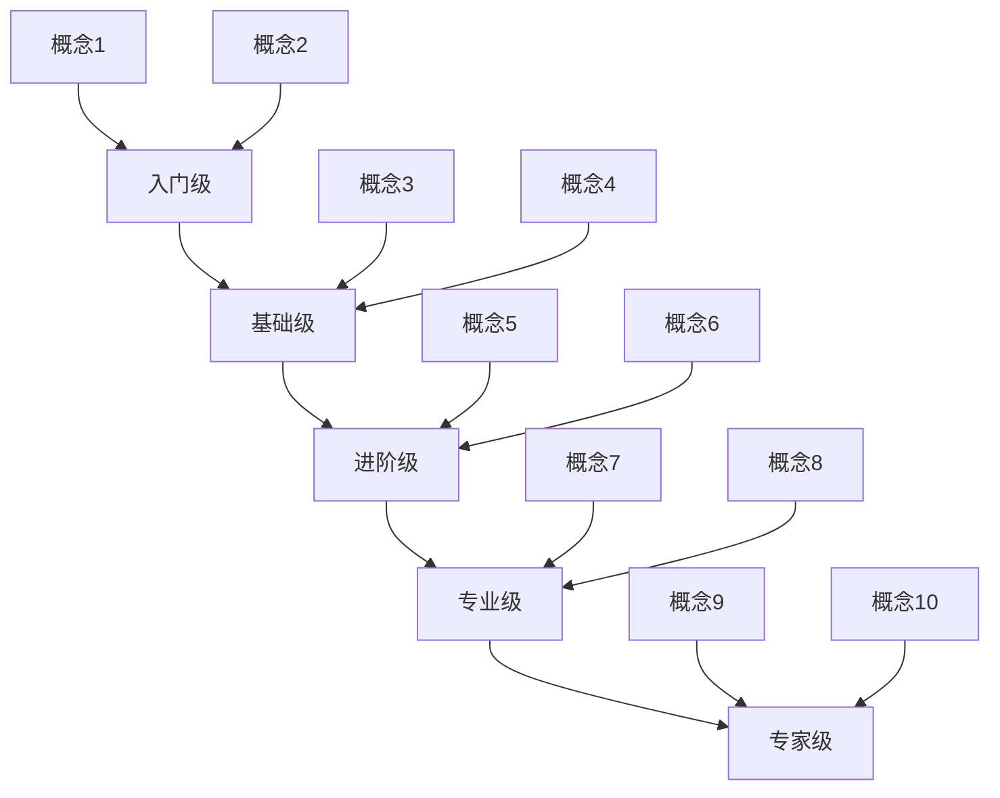

# <% tp.file.title %> 学习路径

## 📋 概述

<!-- 简要描述该技术领域及学习路径的目标和意义 -->

## 🏆 技能等级

### 入门级 (L1)

**核心概念：**
- 概念1
- 概念2

**掌握技能：**
- [ ] 技能1 
- [ ] 技能2

**推荐资源：**
- [[资源链接1]]
- [外部资源名称](外部资源链接)

**实践项目：**
- 入门项目1：项目描述
- 入门项目2：项目描述

### 基础级 (L2)

**核心概念：**
- 概念1
- 概念2

**掌握技能：**
- [ ] 技能1 
- [ ] 技能2

**推荐资源：**
- [[资源链接1]]
- [外部资源名称](外部资源链接)

**实践项目：**
- 基础项目1：项目描述
- 基础项目2：项目描述

### 进阶级 (L3)

**核心概念：**
- 概念1
- 概念2

**掌握技能：**
- [ ] 技能1 
- [ ] 技能2

**推荐资源：**
- [[资源链接1]]
- [外部资源名称](外部资源链接)

**实践项目：**
- 进阶项目1：项目描述
- 进阶项目2：项目描述

### 专业级 (L4)

**核心概念：**
- 概念1
- 概念2

**掌握技能：**
- [ ] 技能1 
- [ ] 技能2

**推荐资源：**
- [[资源链接1]]
- [外部资源名称](外部资源链接)

**实践项目：**
- 专业项目1：项目描述
- 专业项目2：项目描述

### 专家级 (L5)

**核心概念：**
- 概念1
- 概念2

**掌握技能：**
- [ ] 技能1 
- [ ] 技能2

**推荐资源：**
- [[资源链接1]]
- [外部资源名称](外部资源链接)

**实践项目：**
- 专家项目1：项目描述
- 专家项目2：项目描述

## 🛣️ 学习路线图

## 📚 关键知识体系

<!-- 将该领域的知识点按照逻辑关系组织起来 -->

### 基础知识体系
- 主题1
  - 子主题1.1
  - 子主题1.2
- 主题2
  - 子主题2.1
  - 子主题2.2

### 工具与实践
- 工具1
- 工具2
- 实践方法1
- 实践方法2

### 进阶专题
- 专题1
- 专题2

## 📝 学习进度跟踪

<!-- 用于记录个人在该学习路径上的进度 -->

**当前级别**：入门级 (L1)

**正在学习**：
- [ ] 技能/概念

**已完成**：
- [x] 技能/概念

**下一步计划**：
- [ ] 技能/概念

## 🔗 相关领域与扩展

<!-- 相关的技术领域和扩展方向 -->
- [[相关领域1学习路径]]
- [[相关领域2学习路径]]

## 📊 技能评估标准

| 级别 | 描述 | 评估方式 | 典型角色 |
|------|------|---------|---------|
| L1 | 入门级描述 | 完成X、Y、Z任务 | 初学者 |
| L2 | 基础级描述 | 完成X、Y、Z任务 | 初级开发者 |
| L3 | 进阶级描述 | 完成X、Y、Z任务 | 中级开发者 |
| L4 | 专业级描述 | 完成X、Y、Z任务 | 高级开发者 |
| L5 | 专家级描述 | 完成X、Y、Z任务 | 技术专家 |

## 📅 更新记录

- <% tp.date.now("YYYY-MM-DD") %> - 创建初始版本

<%* tp.meta.set("updated", tp.date.now("YYYY-MM-DD HH:mm")) %> 