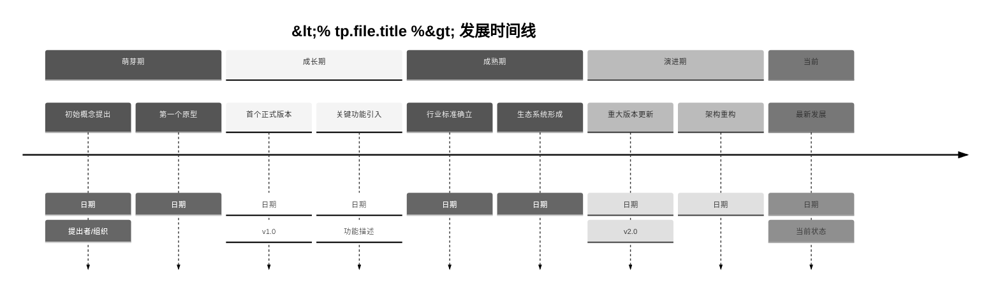
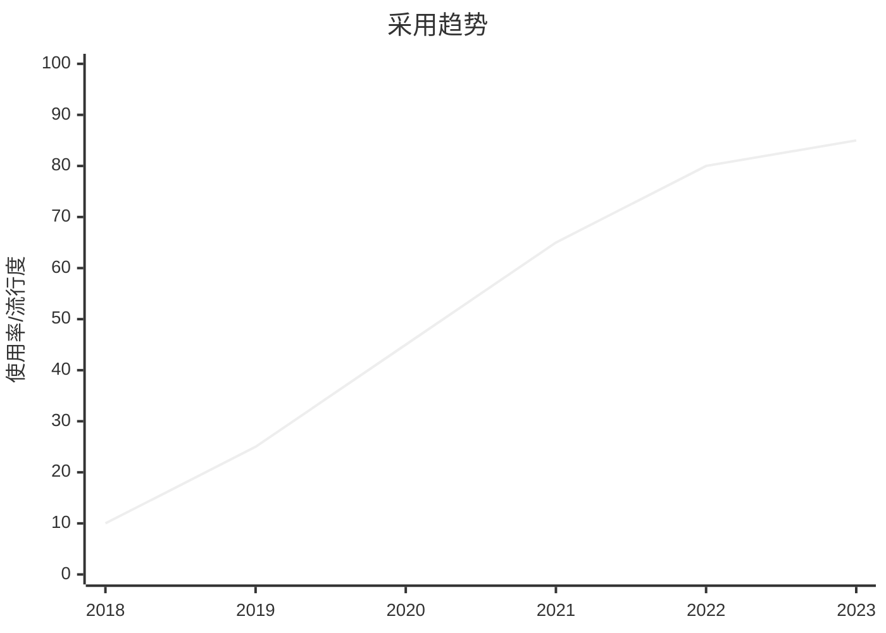
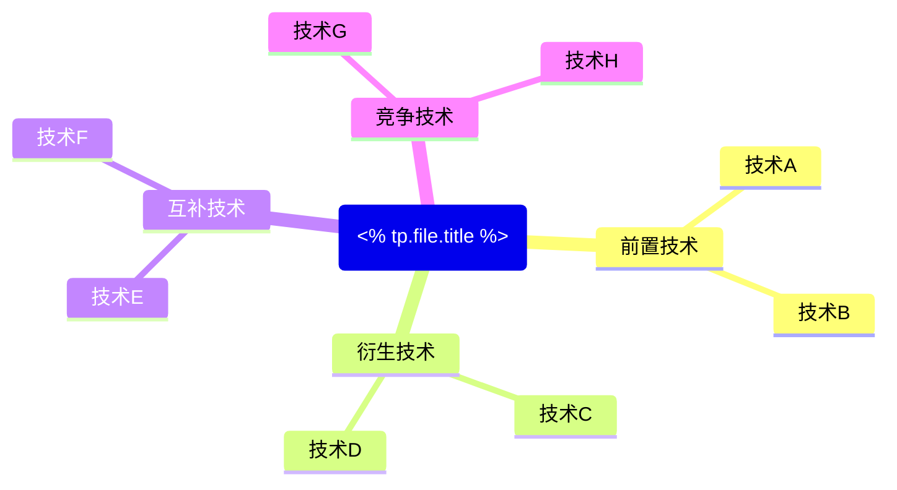

# <% tp.file.title %> 技术演进时间线

## 📋 技术概述

**技术领域**：<!-- 所属技术领域，如前端、AI、后端等 -->

**核心价值**：<!-- 该技术解决的主要问题或带来的价值 -->

**主要竞争技术**：<!-- 同类或竞争关系的技术 -->

## ⏳ 发展里程碑

## 📊 版本历史详情

### 主要版本发布

| 版本号 | 发布日期 | 主要特性 | 重大变化 | 兼容性 |
|-------|---------|--------|---------|-------|
| v1.0 | YYYY-MM-DD | | | |
| v1.1 | YYYY-MM-DD | | | |
| v2.0 | YYYY-MM-DD | | | |
| ... | ... | ... | ... | ... |
| 最新版本 | YYYY-MM-DD | | | |

### 弃用特性与迁移路径

| 弃用特性 | 弃用版本 | 替代方案 | 迁移指南 |
|---------|---------|---------|---------|
| 特性1 | vX.Y | 新特性A | [[迁移指南链接]] |
| 特性2 | vX.Y | 新特性B | [[迁移指南链接]] |

## 🔄 技术范式转变

### 设计理念变迁

### 核心范式转变点

| 时间点 | 旧范式 | 新范式 | 转变驱动因素 | 影响 |
|-------|-------|-------|------------|------|
| YYYY-MM | | | | |
| YYYY-MM | | | | |

## 📈 流行度与采用情况

### 使用趋势

### 行业标准与认可

| 时间 | 标准/认可机构 | 影响 |
|------|--------------|------|
| YYYY-MM | | |
| YYYY-MM | | |

## 🔍 关键影响因素

### 技术推动者

| 人物/组织 | 贡献 | 影响时期 |
|----------|------|---------|
| | | |
| | | |

### 市场/社区因素

| 因素 | 影响 | 时间点 |
|------|------|-------|
| | | |
| | | |

## 🧩 与相关技术的关系

### 技术生态系统

### 重要集成与互操作

| 相关技术 | 关系类型 | 集成点 | 参考资料 |
|---------|---------|-------|---------|
| | | | |
| | | | |

## 📚 技术演进教训

### 成功因素

1. 
2. 
3. 

### 挑战与教训

1. 
2. 
3. 

## 🔮 未来发展预测

### 近期演进方向

| 预期发展 | 可能时间点 | 影响分析 | 准备策略 |
|---------|-----------|---------|---------|
| | | | |
| | | | |

### 长期趋势

| 趋势预测 | 指标迹象 | 战略考量 |
|---------|---------|---------|
| | | |
| | | |

## 🔗 相关资源

### 官方资源

- [官方网站](URL)
- [文档](URL)
- [GitHub仓库](URL)

### 学习资源

- [[相关学习资源1]]
- [[相关学习资源2]]
- [外部教程](URL)

### 社区资源

- [社区论坛](URL)
- [用户组](URL)
- [Stack Overflow标签](URL)

## 🔄 更新记录

- <% tp.date.now("YYYY-MM-DD") %> - 创建技术演进时间线

<%* tp.meta.set("updated", tp.date.now("YYYY-MM-DD HH:mm")) %> 