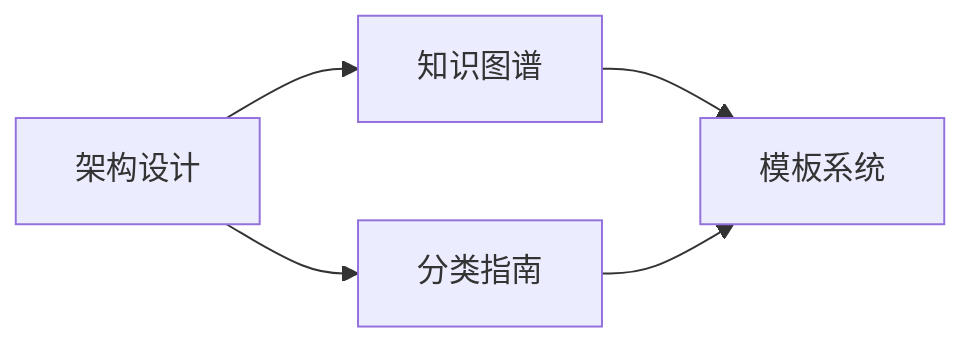

# AI知识库架构文档

## 简介
本目录包含AI知识库的核心架构文档，定义了知识管理的基本规范和最佳实践。

## 核心文档

### 1. [知识库架构设计](knowledge-base-architecture.md)
- 整体架构设计
- 文件组织规范
- 版本控制策略
- 更新维护机制

### 2. [知识分类指南](classification-guide.md)
- 分类体系定义
- 标签规范说明
- 目录组织方案
- 内容质量标准

### 3. [知识图谱模板](../提示词工程/templates/knowledge-graph-template.md)
- 知识图谱生成
- 关系分析方法
- 示例和最佳实践

## 快速开始

1. 阅读[知识库架构设计](knowledge-base-architecture.md)了解整体架构
2. 参考[分类指南](classification-guide.md)进行内容组织
3. 使用[知识图谱模板](../提示词工程/templates/knowledge-graph-template.md)构建知识关联

## 使用指南

1. **新增内容**
   - 遵循分类指南的规范
   - 使用统一的文档模板
   - 保持适当的知识关联

2. **维护更新**
   - 定期检查文档时效性
   - 及时更新知识图谱
   - 保持分类体系的一致性

3. **质量控制**
   - 遵循文档质量标准
   - 保持知识关联的准确性
   - 维护有效的索引结构

## 更新日志

- 2024-04-03：创建核心架构文档
- 2024-04-03：添加知识图谱模板
- 2024-04-03：完善分类指南
