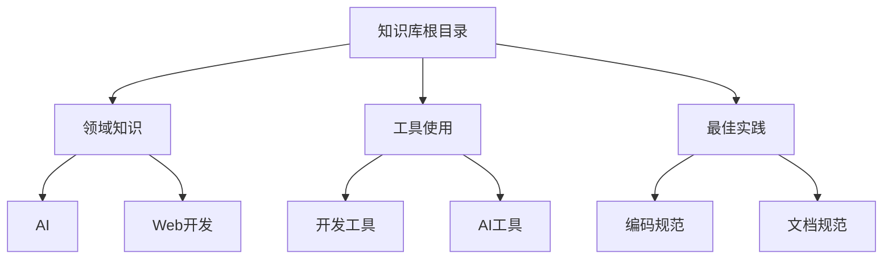

# 知识库架构设计

## 1. 整体架构



## 2. 文件组织规范

### 2.1 目录结构
- 每个主题一个独立目录
- 目录名使用中文，便于理解
- 子目录用于细分主题

### 2.2 文件命名
- 使用kebab-case (如: `knowledge-base-architecture.md`)
- 文件名应反映内容主题
- README.md用于目录说明

### 2.3 文档结构
```markdown
# 标题

## 摘要/简介
[简要说明文档内容]

## 主要内容
[核心内容]

## 相关链接
[相关文档/资源链接]

## 更新记录
[版本更新信息]
```

## 3. 知识关联机制

### 3.1 标签系统
使用YAML front matter进行标记：
```yaml
---
tags: [AI, 提示词工程, 最佳实践]
category: 技术
level: 进阶
created: 2024-04-03
updated: 2024-04-03
---
```

### 3.2 文档关联
- 使用相对路径链接相关文档
- 在文档底部维护"相关文档"区域
- 使用双向链接 `[[文档名]]`

## 4. 检索机制

### 4.1 索引结构
- 按主题建立索引
- 维护标签索引
- 创建时间线索引

### 4.2 快速导航
- 每个目录保持README.md更新
- 使用目录树展示结构
- 关键词搜索支持

## 5. 文档质量规范

### 5.1 基本要求
- 清晰的标题和结构
- 适当的示例和说明
- 及时的更新维护

### 5.2 内容标准
- 准确性：信息必须准确
- 实用性：注重实践指导
- 完整性：避免碎片化
- 可维护性：便于更新

## 6. 版本控制

### 6.1 提交规范
- feat: 新功能
- docs: 文档更新
- fix: 修正错误
- style: 格式调整
- refactor: 重构

### 6.2 分支策略
- main: 稳定版本
- draft: 草稿工作
- feature: 新特性

## 7. 更新维护

### 7.1 定期审查
- 每月检查过期内容
- 更新技术变化
- 补充新的最佳实践

### 7.2 反馈机制
- Issues跟踪问题
- Discussions讨论改进
- Pull Requests贡献
