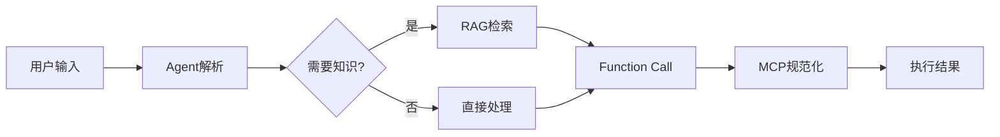
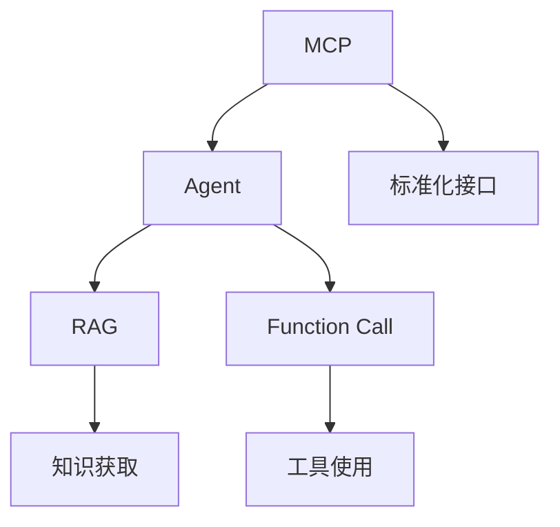

# 大模型核心特性解析

大模型(LLM)的能力不仅仅限于对话,通过不同的技术特性的组合,可以实现更强大的应用场景。本文将介绍四个核心特性及其关系。

## 速查手册 (Cheatsheet)

### 核心特性速查表

| 特性 | 定义 | 关键点 | 应用场景 |
|------|------|--------|----------|
| Agent | 自主决策执行系统 | 目标导向、任务分解 | 项目管理、智能助理 |
| RAG | 检索增强生成 | 知识检索、上下文融合 | 知识问答、文档分析 |
| Function Call | 工具调用能力 | API调用、参数校验 | 数据处理、系统操作 |
| MCP | 通信协议标准 | 接口规范、工具注册 | 生态集成、标准化 |

### 常见集成模式



### 问题排查指南

1. **Agent 相关**
   - 任务分解不当: 检查目标定义
   - 决策循环: 优化决策逻辑
   - 工具选择错误: 完善工具注册

2. **RAG 相关**
   - 检索效果差: 优化索引/向量
   - 知识过时: 更新知识库
   - 上下文丢失: 调整检索策略

3. **Function Call 相关**
   - 参数错误: 完善参数校验
   - 调用失败: 检查错误处理
   - 性能问题: 优化调用策略

4. **MCP 相关**
   - 工具注册失败: 检查协议实现
   - 接口不兼容: 确认版本匹配
   - 安全问题: 检查认证机制

### 性能优化建议

1. **响应速度**
   - RAG 使用缓存
   - 并行 Function Call
   - 优化决策链路

2. **准确度**
   - 优化 RAG 检索策略
   - 完善错误处理
   - 增强上下文管理

3. **可靠性**
   - 实现重试机制
   - 添加监控指标
   - 做好日志记录

### 最佳实践速查

1. **架构设计**
   ```
   User Request
     ↓
   Agent(决策层)
     ↓
   RAG/Function Call(能力层)
     ↓
   MCP(协议层)
     ↓
   External Tools
   ```

2. **开发流程**
   - 定义明确的接口协议
   - 实现完善的错误处理
   - 建立可靠的测试流程
   - 保持文档的同步更新

3. **运维建议**
   - 监控关键指标
   - 定期更新知识库
   - 及时处理异常
   - 保持系统安全

## 核心特性详解

### MCP (Model Context Protocol, 模型上下文协议)

- **定义**: 标准化 AI 与外部数据/工具的通信协议
- **本质**: 协议/规范
- **比喻**: 像标准化的 USB 接口,让 AI 可以统一地连接各种工具
- **价值**: 
  - 提供统一的接口规范
  - 简化工具接入流程
  - 提高系统可扩展性

### RAG (Retrieval Augmented Generation, 检索增强生成)

- **定义**: 检索外部知识 + 增强提示 + 生成回答的技术框架
- **本质**: 技术框架/方法
- **比喻**: 就像写论文前先查阅资料和参考文献
- **工作流程**:
  1. 检索相关知识
  2. 将知识融入提示
  3. 生成高质量回答

### Agent (智能体)

- **定义**: LLM 驱动的自主决策与任务执行系统
- **本质**: 系统/应用范式
- **比喻**: 一个能干的私人助理
- **特点**:
  - 目标导向
  - 自主决策
  - 任务分解
  - 工具使用

### Function Call (函数调用)

- **定义**: LLM 请求执行外部预定义函数/工具的能力
- **本质**: 模型能力/特性
- **比喻**: 助理按指令使用各种 App 完成任务
- **应用**: 
  - API 调用
  - 工具使用
  - 数据处理

## 特性间的关系



- **Agent 作为核心指挥官**:
  - 使用 RAG 获取知识
  - 通过 Function Call 执行操作
  - 基于 MCP 标准接入工具

- **RAG 作为知识基础**:
  - 为 Agent 提供知识支持
  - 增强回答的准确性
  - 降低幻觉风险

- **Function Call 作为执行手段**:
  - 实现具体工具调用
  - 执行外部操作
  - 处理结构化数据

- **MCP 作为底层标准**:
  - 规范化工具接入
  - 统一接口定义
  - 提高可扩展性

## 应用场景与最新发展

### 典型应用场景

1. **智能文档助手** (如 Claude、ChatGPT)
   - Agent: 理解用户需求,规划任务步骤
   - RAG: 检索相关文档内容
   - Function Call: 执行文档操作(创建、修改、格式化等)
   - 实例: Notion AI、Microsoft Copilot

2. **代码开发助手** (如 GitHub Copilot)
   - Agent: 分析编程需求,设计解决方案
   - RAG: 检索代码库和文档
   - Function Call: 调用编译、测试工具
   - 实例: Amazon CodeWhisperer、Codeium

3. **智能客服系统** (如 Claude 2)
   - Agent: 理解客户问题,决策处理方案
   - RAG: 检索产品知识库
   - Function Call: 访问订单系统、执行业务操作
   - 实例: Intercom AI、Ada Support

4. **数据分析助手** (如 ChatGPT + 插件)
   - Agent: 分析需求,设计分析流程
   - RAG: 获取分析方法知识
   - Function Call: 调用数据处理API
   - 实例: Tableau AI、Power BI

### 最新技术发展

1. **高级 Agent 框架**
   - AutoGPT: 自主执行复杂任务
   - BabyAGI: 任务分解与规划
   - LangChain: Agent 工具集成框架

2. **RAG 技术进步**
   - 混合检索策略
   - 语义缓存优化
   - 知识图谱集成

3. **Function Calling 增强**
   - 并行调用能力
   - 工具组合优化
   - 错误处理机制

4. **MCP 生态建设**
   - 工具市场标准化
   - 安全性增强
   - 跨平台兼容性

## 最佳实践与总结

### 核心最佳实践

1. **Agent 设计**
   - 明确定义任务边界
   - 实现灵活的工具调用策略 
   - 建立有效的错误处理机制
   - 保持执行过程可追踪

2. **RAG 实现**
   - 优化知识库构建
   - 实现高效的检索策略
   - 注重上下文相关性
   - 定期更新知识base

3. **Function Call 规范**
   - 设计清晰的接口定义
   - 实现参数严格校验
   - 保持良好的错误处理
   - 支持异步操作处理

4. **MCP 应用**
   - 遵循标准协议规范
   - 实现安全认证机制
   - 保持接口向后兼容
   - 支持灵活的工具注册

### 发展趋势与展望

- **融合发展**: 四大特性深度整合,形成完整解决方案
- **标准化**: MCP推动工具生态标准化发展
- **智能化**: Agent决策能力不断提升
- **实用性**: 更多垂直领域的落地应用

### 总结

这四个特性构成了现代AI应用的核心技术栈:
- Agent 作为智能决策大脑
- RAG 提供可靠知识支持
- Function Call 实现功能扩展
- MCP 确保生态标准化

通过深入理解和合理运用这些特性,我们可以构建更强大、更实用的AI应用系统。
