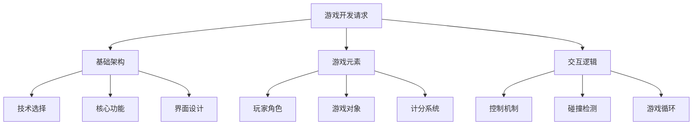
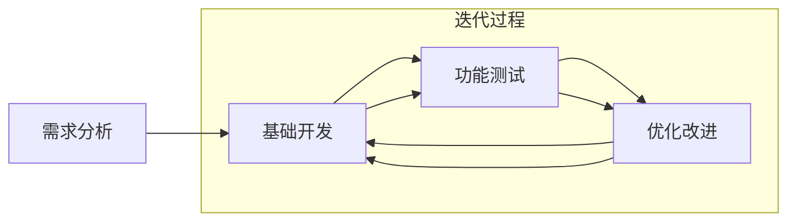
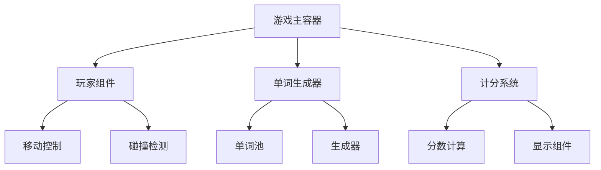

# Claude 游戏开发提示词 Cheatsheet



## 基本模板

### 1. 基础架构请求
```
创建一个[游戏类型]游戏的完整 HTML 文件：

技术要求：
- 使用的框架：[框架名称]
- 样式方案：[样式框架]
- 响应式设计：[是/否]

游戏核心功能：
1. [功能1]
2. [功能2]
3. [功能3]

交互要求：
- 控制方式：[具体说明]
- 游戏机制：[具体说明]
- 计分系统：[具体说明]
```

### 2. 游戏元素定义
```
定义游戏元素：

1. 玩家角色：
   - 外观：[描述]
   - 移动方式：[WASD/方向键/其他]
   - 碰撞检测：[需求说明]

2. 游戏对象：
   - 类型：[描述]
   - 生成规则：[描述]
   - 交互逻辑：[描述]

3. 计分规则：
   - 得分方式：[描述]
   - 分数显示：[位置和样式]
```

## 实际案例分析

### 1. 打字游戏示例
```
// 需求描述
创建一个网页打字游戏：
- 使用 WASD 移动角色
- 遇到单词时进行打字挑战
- 根据打字速度计分
- 使用 Tailwind 美化界面

// 核心组件
1. 游戏容器
2. 玩家角色
3. 随机单词生成
4. 打字输入框
5. 计分系统

// 交互逻辑
1. 移动检测
2. 碰撞检测
3. 打字验证
4. 分数计算
```

### 2. 关键代码片段

#### 玩家移动
```javascript
document.addEventListener('keydown', (e) => {
  if (e.key === 'w') playerY -= speed;
  if (e.key === 'a') playerX -= speed;
  if (e.key === 's') playerY += speed;
  if (e.key === 'd') playerX += speed;
});
```

#### 碰撞检测
```javascript
function checkCollision(word) {
  const playerRect = player.getBoundingClientRect();
  const wordRect = word.getBoundingClientRect();
  return !(
    playerRect.right < wordRect.left ||
    playerRect.left > wordRect.right ||
    playerRect.bottom < wordRect.top ||
    playerRect.top > wordRect.bottom
  );
}
```

#### 分数计算
```javascript
function endInput() {
  const endTime = Date.now();
  const elapsedTime = endTime - startTime;
  const timeBonus = Math.max(2000 - elapsedTime, 0);
  score += Math.round(1000 + timeBonus);
}
```

## API 使用指南

### 1. Python 请求模板
```python
import anthropic

client = anthropic.Anthropic(
    api_key="your_api_key",
)

message = client.messages.create(
    model="claude-3-sonnet-20240229",
    max_tokens=2000,
    temperature=0,
    messages=[
        {
            "role": "user",
            "content": [
                {
                    "type": "text",
                    "text": """
                    创建[游戏类型]：
                    
                    要求：
                    1. [要求1]
                    2. [要求2]
                    
                    技术栈：
                    - [技术1]
                    - [技术2]
                    """
                }
            ]
        }
    ]
)
```

## 提示词优化技巧

1. **明确需求**
   - 指定具体的游戏类型和玩法
   - 列出所有核心功能
   - 说明技术要求和限制

2. **结构化描述**
   - 分类列出游戏元素
   - 清晰定义交互逻辑
   - 指定具体的实现细节

3. **迭代改进**
   ```
   // 第一次请求：基础功能
   创建基础游戏框架
   
   // 后续优化：
   请在上述代码基础上：
   1. 添加[新功能]
   2. 优化[具体部分]
   3. 改进[具体机制]
   ```

## 注意事项

1. **代码生成**
   - 要求生成完整可运行的代码
   - 指定依赖和框架版本
   - 包含必要的注释和文档

2. **游戏设计**
   - 考虑游戏平衡性
   - 添加适当的难度曲线
   - 包含足够的游戏反馈

3. **性能优化**
   - 注意动画性能
   - 优化碰撞检测
   - 合理使用资源

## 游戏开发流程



## 组件关系


