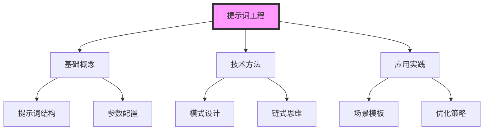

# 知识图谱生成模板

## 目标
生成特定主题领域的知识图谱，展示概念之间的关联关系。

## 模板结构

### 1. 基础信息收集
```prompt
请分析[主题名称]相关的内容，识别以下要素：
1. 核心概念
2. 关键组成部分
3. 重要技术/方法
4. 应用场景
5. 相关工具/框架
```

### 2. 关系分析
```prompt
对于[主题名称]中识别出的要素，请：
1. 确定要素之间的关系类型：
   - 包含关系
   - 依赖关系
   - 演化关系
   - 应用关系
2. 标注关系的方向和强度
3. 指出关键的连接点
```

### 3. 图谱生成
```prompt
请使用Mermaid语法生成一个知识图谱，要求：
1. 使用不同的节点形状表示不同类型的概念
2. 用有向边表示关系
3. 添加简明的关系说明
4. 确保图谱层次清晰
5. 突出核心概念

示例结构：
graph TD
    A[核心概念] --> B[组成部分]
    A --> C[技术方法]
    B --> D[具体实现]
    C --> E[应用场景]
    
    classDef core fill:#f9f,stroke:#333,stroke-width:4px;
    class A core;
```

### 4. 知识点扩展
```prompt
对于[主题名称]的知识图谱：
1. 列出每个核心概念的：
   - 定义和特点
   - 最佳实践
   - 常见问题
2. 提供学习路径建议
3. 标注进阶方向
```

## 使用说明

1. 替换[主题名称]为具体主题
2. 按需调整模板参数：
   - 深度：概念展开的层级
   - 广度：关联概念的范围
   - 重点：需要特别关注的方面

## 示例应用

### 输入示例
```prompt
使用此模板分析"提示词工程"主题：

1. 基础信息收集：
   主题：提示词工程
   深度：3层
   广度：包含相关工具和最佳实践
   重点：实践应用

2. 关系分析要求：
   - 突出工程实践
   - 关注技术演进
   - 标注应用场景
```

### 预期输出


## 注意事项

1. 确保图谱结构清晰，避免过度复杂
2. 保持关系描述简洁准确
3. 定期更新和优化知识点
4. 注意添加实际应用示例
5. 标注参考资源和延伸阅读

## 相关文档
- [[knowledge-base-architecture.md]]
- 提示词工程基础配置
- 最佳实践指南

## 更新记录
- 2024-04-03：创建模板
- 2024-04-03：添加示例应用
