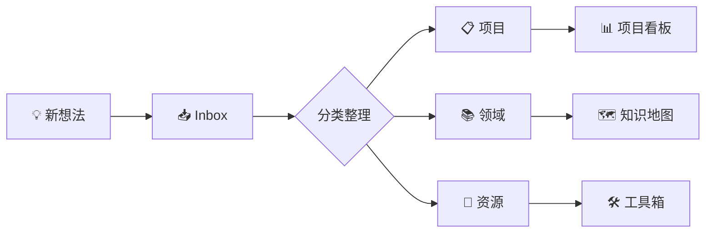

# Personal Knowledge Management System

这是一个个人知识管理系统，专注于技术学习和研究，采用扁平化MOC结构提升导航效率。

## 🚀 快速开始

### 主要入口

| 入口 | 功能 | 说明 |
|------|------|------|
| [🚀 快速导航](99-system/MOCs/00-快速导航.md) | 全局入口，5秒内找到任何内容 | **推荐起点** |
| [📋 项目看板](99-system/MOCs/10-项目看板.md) | 所有活跃项目状态 | 项目管理 |
| [🗺️ 知识地图](99-system/MOCs/20-知识地图.md) | 按主题聚合的知识网络 | 知识探索 |
| [🛠️ 工具箱](99-system/MOCs/30-工具箱.md) | 常用工具和资源 | 效率提升 |
| [📊 维护面板](99-system/MOCs/99-维护面板.md) | 系统健康度监控 | 系统维护 |

## 📂 目录结构

```
notes/
├── 00-inbox/           # 收集箱：新内容临时存放
├── 10-projects/        # 项目：有交付物或截止日期的事务
├── 20-areas/          # 领域：持续关注的职责域
├── 30-resources/      # 资源：可复用的参考资料和模板
├── 90-archive/        # 归档：已完成或弃置的内容
└── 99-system/         # 系统：模板、脚本、MOC导航
    └── MOCs/          # 扁平化MOC结构
        ├── 00-快速导航.md
        ├── 10-项目看板.md  
        ├── 20-知识地图.md
        ├── 30-工具箱.md
        └── 99-维护面板.md
```

## 🎯 MOC设计理念

### 扁平化结构优势

1. **减少导航层级** - 从原有的复杂嵌套结构简化为5个核心入口
2. **功能专业化** - 每个MOC专注特定功能，避免信息过载
3. **快速跳转** - 每个MOC都有"2分钟速览"区域
4. **实时查询** - 使用Dataview动态展示最新数据

### 各MOC功能定位

- **快速导航**：5秒内定位任何内容的全局入口
- **项目看板**：项目状态、进度、任务的可视化管理
- **知识地图**：主题关联、学习路径、知识网络展示
- **工具箱**：开发工具、效率工具、最佳实践收集
- **维护面板**：系统健康度、问题检测、维护任务

## 📝 使用指南

### 1. 内容管理流程



### 2. 文件命名规范

- **文件夹**：`XX-job-domain` 格式（如：`10-projects`, `20-areas`）
- **文件**：`XX-中文名.md` 格式（如：`01-前端开发.md`）
- **MOC文件**：`00-MOC-主题.md` 格式确保置顶

### 3. 元数据规范

```yaml
---
title: 文档标题
jd_id: J10-YYYYMMDD-HHMM # Johnny-Decimal ID
created: YYYY-MM-DD HH:MM # 创建时间
updated: YYYY-MM-DD HH:MM # 更新时间
type: note # moc / guide / note ...
status: draft # draft / active / archived
tags: [] # 主题检索标签
---
```

### 4. 标签系统

使用四个顶级命名空间：

- `#topic/` - 主题分类（如：`#topic/ai`, `#topic/frontend`）
- `#status/` - 内容状态（如：`#status/active`, `#status/draft`）
- `#action/` - 行动项目（如：`#action/todo`, `#action/reading`）
- `#lang/` - 编程语言（如：`#lang/javascript`, `#lang/python`）

## 🔧 维护指南

### 日常维护

- **每日**：处理收集箱内容（10分钟）
- **每周**：检查项目进度，更新MOC（20分钟）
- **每月**：系统健康检查，优化结构（1小时）

### 质量标准

- 孤岛笔记比例 ≤ 5%
- 收集箱内容滞留 ≤ 7天
- 项目状态更新及时性 ≤ 3天

### 自动化工具

- **Dataview** - 动态查询和数据展示
- **Templater** - 模板自动化
- **Tag Wrangler** - 标签管理
- **Git** - 版本控制和备份

## 🎓 最佳实践

### 内容创建

1. **快速捕获** - 先记录在inbox，后整理
2. **建立连接** - 每个笔记至少链接到一个其他笔记
3. **定期回顾** - 利用维护面板检查系统健康度

### 知识管理

1. **主题聚焦** - 深度优于广度
2. **实践导向** - 记录应用案例和实践经验
3. **持续迭代** - 定期更新和完善内容

### 效率提升

1. **使用快捷键** - `Ctrl+O` 快速打开，`Ctrl+Shift+F` 全局搜索
2. **书签导航** - 将常用MOC加入浏览器书签
3. **模板利用** - 使用标准模板提升创建效率

## 📊 系统监控

通过[维护面板](99-system/MOCs/99-维护面板.md)可以实时监控：

- 文档数量和分布
- 孤岛笔记检测
- 链接完整性检查
- 标签使用统计
- 更新活跃度分析

---

> [!tip] 使用建议
> 🚀 从[快速导航](99-system/MOCs/00-快速导航.md)开始，体验新的扁平化MOC导航系统
> 
> 📱 在移动设备上建议使用全局搜索功能快速定位内容