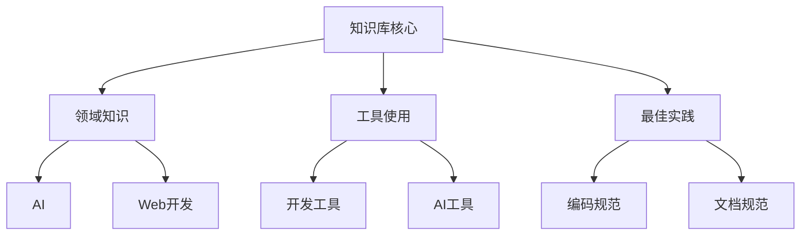

# 系统模式

## 系统架构
这个笔记管理系统采用分层架构设计：

### 物理架构

```
notes/                      # 根目录
│
├── memory-bank/           # 记忆库（项目元数据和核心文档）
│   ├── projectbrief.md    # 项目概述
│   ├── productContext.md  # 产品背景
│   └── ...                # 其他记忆库文件
│
├── AI/                    # AI 相关笔记
│   ├── README.md         # AI 部分概述
│   ├── architecture/     # 架构设计文档
│   │   ├── knowledge-base-architecture.md
│   │   └── classification-guide.md
│   ├── 提示词工程/        # 提示词工程子主题
│   │   ├── templates/    # 提示词模板
│   │   ├── 基本配置.md
│   │   └── ...
│   ├── cline/            # Cline 相关内容
│   │   └── ...
│   └── ...
│
├── React/                # React 相关笔记
│   └── ...
│
└── ...                   # 其他主题文件夹
```

### 逻辑架构


## 关键技术决策
1. **文档标准**：
   - 使用 Markdown 作为标准格式
   - 采用YAML front matter进行元数据管理
   - 标准化文档模板

2. **组织架构**：
   - 基于文件系统的层次组织
   - 知识图谱驱动的关联组织
   - 多维度分类系统

3. **版本控制**：
   - 使用Git进行版本管理
   - 分支策略用于内容迭代
   - 变更追踪和历史记录

4. **模块化设计**：
   - 独立的主题模块
   - 可重用的模板系统
   - 灵活的扩展机制

## 架构模式

1. **知识组织模式**：
   ```mermaid
   graph LR
       A[主题领域] --> B[知识模块]
       B --> C[具体文档]
       C --> D[知识点]
   ```
   - 自顶向下的层次组织
   - 横向的知识关联
   - 元数据驱动的分类

2. **文档结构模式**：
   - 统一的模板结构
   - 标准化的格式规范
   - 一致的元数据标记

3. **知识关联模式**：
   - 显式链接
   - 标签关联
   - 知识图谱映射

4. **元数据管理模式**：
   - YAML front matter
   - 分类标签系统
   - 版本和状态追踪

## 组件关系

1. **核心组件**：
   ```mermaid
   graph TD
       A[Memory Bank] --> B[架构文档]
       A --> C[分类指南]
       A --> D[模板系统]
       
       B --> E[知识内容]
       C --> E
       D --> E
   ```

2. **知识关联网络**：
   - Memory Bank定义核心架构
   - 架构文档指导实现
   - 分类体系规范组织
   - 模板确保一致性

3. **文档层次体系**：
   - 架构设计文档
   - 分类与规范文档
   - 模板与工具文档
   - 具体知识内容
   - 资源与引用

## 实现路径

1. **知识管理流程**：
   ```mermaid
   graph LR
       A[收集] --> B[分类]
       B --> C[组织]
       C --> D[关联]
       D --> E[维护]
   ```

2. **内容处理流程**：
   - 主题分类与定位
   - 应用标准模板
   - 添加元数据标记
   - 建立知识关联
   - 生成知识图谱
   - 定期维护更新

3. **检索优化路径**：
   - 分类索引导航
   - 标签系统查询
   - 知识图谱探索
   - 全文本搜索
   - 关联推荐

## 治理机制

1. **质量控制**：
   - 文档规范检查
   - 链接有效性验证
   - 内容时效性审查
   
2. **版本管理**：
   - 定期内容审查
   - 版本历史追踪
   - 变更记录维护

3. **持续优化**：
   - 收集使用反馈
   - 优化分类体系
   - 更新最佳实践
