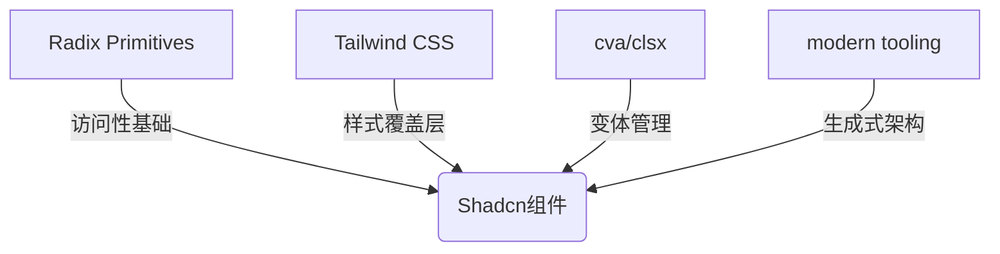

# Tailwind CSS + UI

UI 框架的选择越来越丰富，主要分两种:

1. 企业级（后台管理类），Umi + Ant Design + Ant Design Pro 是个一成熟且不错的方案。
2. 自建搭建组件：Tailwind CSS + Shadcn/UI，该方案更加灵活，显然大大增加了成本。
3. TODO：如何做响应式，甚至是移动优先呢？

## **Shadcn/UI**

官网介绍：https://ui.shadcn.com/docs

**结构如下：**



**📦 核心工具链速**

| **工具** | **作用描述** | **典型代码示例** |
| --- | --- | --- |
| **clsx** | 类名条件合并 | `className={clsx('base', isActive && 'active')}` |
| **tailwind-merge** | 解决Tailwind类冲突 | `twMerge('px-2 py-1', 'p-3')` → `'p-3'` |
| **cva** | 组件变体管理系统 | [见下方变体管理模块] |
| **Radix Slot** | 组件插槽继承 | `<Slot className={cn('custom-class')}>` |

**基本使用：**

1. **配置好文件入口的别名**
    1. 配置 `tsconfig.json` 中的别名
    2. 添加 `@types/node`
    3. 配置 `vite.config.ts`
2. **初始化项目：**执行 `pnpm dlx shadcn@canary init` 
3. **生成配置文件：**
    1. 
    2.  [查看详细的配置参数](https://ui.shadcn.com/docs/components-json)

## **🚀 常用CLI命令速查**

| **命令** | **功能说明** | **参数示例** |
| --- | --- | --- |
| `shadcn@canary init` | 初始化项目配置 | - |
| `shadcn@canary add <component>` | 添加预置组件 | `button`, `card`, `dropdown` |
| `shadcn@canary build` | 构建自定义注册表 | --registry=[http://internal-reg](http://internal-reg/) |

```bash
# 实战示例：批量添加数据展示组件
pnpm dlx shadcn@canary add table
pnpm dlx shadcn@canary add pagination
```

<aside>
💡

注意

- vite 需要初始化入口文件别名
- [初始化后 `components.json` 生成了各种配置](https://ui.shadcn.com/docs/components-json)
- [动画委托](https://www.radix-ui.com/primitives/docs/guides/animation#delegating-unmounting-for-javascript-animation)
- [使用 cav 定义变体的 API](https://cva.style/docs/getting-started/variants)
- [`Slot`](https://www.radix-ui.com/primitives/docs/utilities/slot)
- 定义变体时事件的执行的顺序
</aside>

### 变体管理

定义：

```tsx
const buttonVariants = cva(
  "base-style", 
  {
    variants: {
      intent: {
        primary: "bg-blue-500 text-white",
        danger: "bg-red-500 text-white"
      },
      size: {
        sm: "text-sm px-3 py-1",
        md: "text-base px-4 py-2"
      }
    },
    compoundVariants: [
      {
        intent: 'primary',
        size: 'md',
        className: 'uppercase' // 复合变体
      }
    ]
  }
)

```

使用

```tsx
// 通过Radix原生支持
<AlertDialog.Root>
  <AlertDialog.Trigger aria-label="重要操作"/>
  <AlertDialog.Portal>
    <AlertDialog.Overlay 
      role="dialog"
      aria-labelledby="alert-title"
    />
  </AlertDialog.Portal>
</AlertDialog.Root>
```

## **🎨 主题定制三板斧(TODO)**

**基础变量覆盖**

**动态主题注入**

**智能响应式断**

### 参考

- [如果你想要快速使用一个 Blocks](https://ui.shadcn.com/blocks)