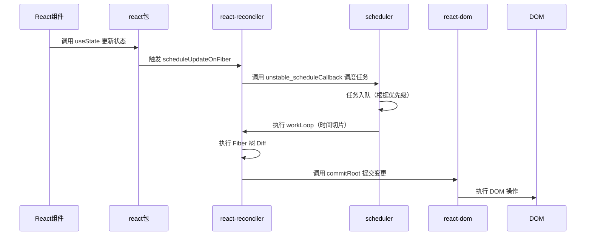

# React 源码

## 参考

https://jser.dev/2023-07-14-initial-mount/

- [react 原理博客](https://blog.isquaredsoftware.com/about/)
- [图解React](https://7km.top/)

[学习工具链](React%20%E6%BA%90%E7%A0%81%201752048329b080589e87df3c96570521/%E5%AD%A6%E4%B9%A0%E5%B7%A5%E5%85%B7%E9%93%BE%2018d2048329b08080811dcad100c1df26.md)

## 基本结构

```markdown
packages/
├── react/                 # React 核心 API
├── react-dom/             # DOM 渲染逻辑
├── react-reconciler/      # 调度和协调逻辑
├── scheduler/             # 任务调度
├── react-server/          # 服务端渲染
├── shared/                # 通用工具函数
├── react-test-renderer/   # 测试支持
├── react-native-renderer/ # React Native 支持
```

调用关系

- `JSX → ReactElement → Fiber树 → DOM更新`
- React 构建的界面，先通过 react 包jsx代码编译成ReactElement元素，然后通过 react-reconciler 包将 ReactElement 元素转换为 Fiber 方便后续的更新和管理，最终使用react-dom将fiber转换为dom元素。其中还有一个包 scheduler，来安排这些任务的优先级和执行时机。

核心机制：

- 时间切片在 scheduler
- Diff 差异算法在 react-reconciler
- 还有一些很重要的数据结果，如任务队列，组件状态在 fiber 上。



## 个人理解

**基础**

[Fiber 对象](React%20%E6%BA%90%E7%A0%81%201752048329b080589e87df3c96570521/Fiber%20%E5%AF%B9%E8%B1%A1%201812048329b08041aeacdf72406325be.md)

[数据结构/模型（旧）](React%20%E6%BA%90%E7%A0%81%201752048329b080589e87df3c96570521/%E6%95%B0%E6%8D%AE%E7%BB%93%E6%9E%84%20%E6%A8%A1%E5%9E%8B%EF%BC%88%E6%97%A7%EF%BC%89%201782048329b08047a6f8e4fa0b7faedf.md)

[React 中的算法](React%20%E6%BA%90%E7%A0%81%201752048329b080589e87df3c96570521/React%20%E4%B8%AD%E7%9A%84%E7%AE%97%E6%B3%95%201922048329b080268b93c5cdbfaf1004.md)

**代码理解**

[React 初始化流程](React%20%E6%BA%90%E7%A0%81%201752048329b080589e87df3c96570521/React%20%E5%88%9D%E5%A7%8B%E5%8C%96%E6%B5%81%E7%A8%8B%201812048329b080dd85aaebac9a58fbb0.md)

[TODO：记录核心知识点](React%20%E6%BA%90%E7%A0%81%201752048329b080589e87df3c96570521/TODO%EF%BC%9A%E8%AE%B0%E5%BD%95%E6%A0%B8%E5%BF%83%E7%9F%A5%E8%AF%86%E7%82%B9%2018c2048329b0809bac89f8ee33dd2c8d.md)

[源码学习-react包](React%20%E6%BA%90%E7%A0%81%201752048329b080589e87df3c96570521/%E6%BA%90%E7%A0%81%E5%AD%A6%E4%B9%A0-react%E5%8C%85%2018d2048329b08069b608c631e6b17a25.md)

[源码学习-scheduler包](React%20%E6%BA%90%E7%A0%81%201752048329b080589e87df3c96570521/%E6%BA%90%E7%A0%81%E5%AD%A6%E4%B9%A0-scheduler%E5%8C%85%2018d2048329b0807e8073ce747f65746d.md)

[源码学习-react-reconciler包](React%20%E6%BA%90%E7%A0%81%201752048329b080589e87df3c96570521/%E6%BA%90%E7%A0%81%E5%AD%A6%E4%B9%A0-react-reconciler%E5%8C%85%2018d2048329b080f1af92e1849759bd4c.md)

[源码学习-react-dom包](React%20%E6%BA%90%E7%A0%81%201752048329b080589e87df3c96570521/%E6%BA%90%E7%A0%81%E5%AD%A6%E4%B9%A0-react-dom%E5%8C%85%2018d2048329b080bb82e3c11cba3bd693.md)

## 关于学习顺序

```markdown
1. react
   └── 基础元素、组件、Hooks → 理解 React 的“静态结构”
2. scheduler
   └── 任务调度、优先级 → 理解 React 的“动态节奏”
3. react-reconciler
   └── Fiber、协调算法 → 理解 React 的“大脑”
4. react-dom
   └── DOM 渲染、事件 → 理解 React 的“手脚”
```

## 乱糟糟的提示词

刚才是在总结一些核心的 api ，现在开始分析这些api设计核心思想，以及背后的考量，请给出干货满满的建设性总结，不要遗漏任何一个关键点。

详细的说下每个包的核心点儿，工作流程，核心概念，编程范式，设计考量，性能优化，架构思想

系统的帮我梳理一下 react 18.2 中xxx的核心方法和核心概念

[草稿](React%20%E6%BA%90%E7%A0%81%201752048329b080589e87df3c96570521/%E8%8D%89%E7%A8%BF%2018e2048329b08005893bfb1587521e23.md)

[hooks 源码执行（草稿）](React%20%E6%BA%90%E7%A0%81%201752048329b080589e87df3c96570521/hooks%20%E6%BA%90%E7%A0%81%E6%89%A7%E8%A1%8C%EF%BC%88%E8%8D%89%E7%A8%BF%EF%BC%89%2018f2048329b0801bbb3ae4cd87ffd64d.md)

[问题](React%20%E6%BA%90%E7%A0%81%201752048329b080589e87df3c96570521/%E9%97%AE%E9%A2%98%201912048329b0809ea359cd606d3565b5.md)

[术语/名词](React%20%E6%BA%90%E7%A0%81%201752048329b080589e87df3c96570521/%E6%9C%AF%E8%AF%AD%20%E5%90%8D%E8%AF%8D%201922048329b080de8439fb41f6f08f4e.md)

[核心算法](React%20%E6%BA%90%E7%A0%81%201752048329b080589e87df3c96570521/%E6%A0%B8%E5%BF%83%E7%AE%97%E6%B3%95%201942048329b0804fbcfdc8b64a7bbee9.md)

[核心概念速记](React%20%E6%BA%90%E7%A0%81%201752048329b080589e87df3c96570521/%E6%A0%B8%E5%BF%83%E6%A6%82%E5%BF%B5%E9%80%9F%E8%AE%B0%201982048329b080108474d2ad30d731f5.md)